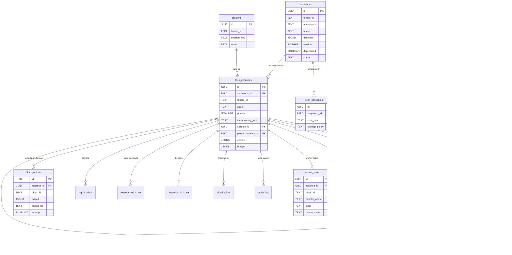
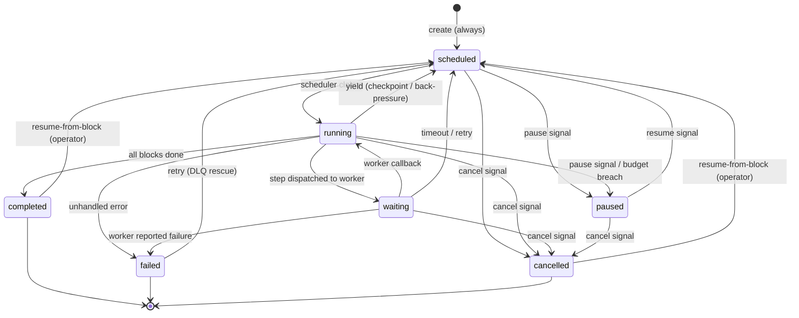
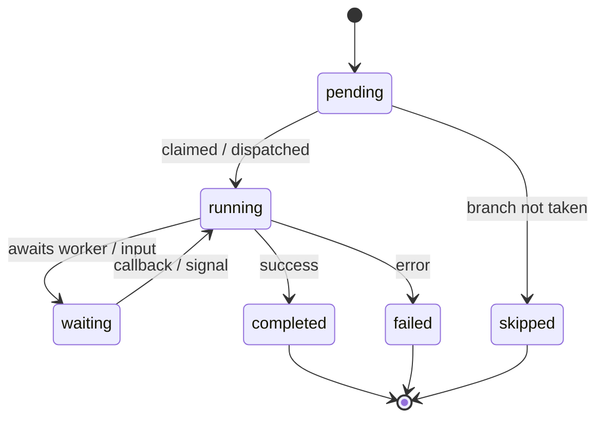

# Orch8 Operator UI — Design Reference

> **Authoritative synthesis + navigation hub** for the Orch8 operator console (Vue 3 + TypeScript).
> This document is the single front door to the full Orch8 HTTP/OpenAPI surface. It reconciles the
> master endpoint inventory against every analyst section, fixes global conventions, and links out to
> per-domain deep-dives in [`./_ref/`](./_ref/) for endpoint-level schema depth.

---

## 1. Purpose, How To Use, and Provenance

### 1.1 Purpose

The operator UI must cover **100% of the Orch8 HTTP API surface**: every workflow lifecycle action,
every resource-management screen, every observability view, and every human-in-the-loop gate. This
reference is the contract the UI is built against. It is the place to answer:

- *Which endpoints exist, what do they do, and who is allowed to call them?*
- *What is the canonical request/response envelope, error model, and auth model?*
- *What entities does the data model contain, and how do they relate?*
- *What business rules must the UI enforce (or surface) before hitting the API?*
- *What is the DAG/block taxonomy and the instance state machine the UI must visualize?*

### 1.2 How To Use This Document

| If you need… | Go to |
|---|---|
| The complete, numbered endpoint list | [§4 Master Endpoint Inventory](#4-master-endpoint-inventory) |
| Auth headers, pagination, error codes, SSE rules | [§3 Global API Conventions](#3-global-api-conventions) |
| A specific domain's request/response schemas | [§5 Domain Map](#5-domain-map) → follow the `./_ref/<slug>.md` link |
| The data model / table relationships | [§6 Entity-Relationship Map](#6-entity-relationship-map) |
| What to validate client-side | [§7 Business-Rule Matrix](#7-business-rule-matrix) |
| Block types, edges, state machines, canvas rules | [§8 DAG Topology Spec](#8-dag-topology-spec) |
| Role-based access decisions | [§9 RBAC Matrix](#9-rbac-matrix) |
| Proof that every endpoint is documented | [§10 Coverage Checklist](#10-coverage-checklist) |
| Known unknowns / things to confirm with backend | [§11 Open Issues](#11-open-issues--pending-confirmations) |

**Do not** treat this file as the schema source of truth for individual fields. For full field tables,
example payloads, and per-endpoint error tables, always click through to the linked `_ref` section.

### 1.3 Source Provenance

- **Source crate:** `orch8-api` (Axum, Rust), plus `orch8-types`, `orch8-engine`, and `orch8-storage`
  migrations (`engine/migrations/001–052`).
- **Runtime OpenAPI export is unavailable.** The generated `openapi.json` could not be obtained. The
  authoritative sources used to assemble this reference are the **`utoipa` annotations** in the handler
  modules plus **direct reading of the Rust source and SQL migrations**.
- **Consequence:** several live HTTP routes are *not* present in the generated OpenAPI/Swagger spec
  because their handlers lack `#[utoipa::path]` annotations. These are flagged inline and in
  [§11](#11-open-issues--pending-confirmations). The UI must treat the source/annotation-derived list
  here — not Swagger — as canonical.
- **Analyst sections** (under `./_ref/`) were authored against assigned subsets of the codebase. Where a
  type lives outside a section's assigned files, it is marked `[INFERRED]` there and carried forward as an
  open issue here.

---

## 2. Executive Overview

**Orch8** is a multi-tenant **workflow orchestration engine**. Operators define *sequences* (versioned
workflow DAGs), launch *instances* of them, and the engine drives each instance through a state machine,
dispatching *steps* either to in-process handlers or to external *workers* (polyglot, via polling). It
supports cron scheduling, event/webhook triggers, human-in-the-loop approval gates, resource pooling with
warmup ramps, circuit breaking, auto-rollback on error-budget breach, time-travel debugging (fork /
resume-from-block / checkpoints), and LLM token/cost accounting.

### 2.1 Operator Surfaces (what the UI must build)

| Surface | What the operator does | Primary domains |
|---|---|---|
| **Workflow Catalog** | Author, version, promote, deprecate, and lint sequences | Sequences, DAG authoring |
| **Run Console** | Launch / batch-launch instances, watch live progress (SSE), inspect timeline, outputs, tree, logs, artifacts, audit | Instances (core + advanced), Streaming |
| **DLQ & Bulk Ops** | Rescue failed instances; bulk pause/resume/cancel/retry; reschedule | Instances |
| **Time-Travel Debugger** | Fork instances, resume-from-block, inject blocks, save/prune checkpoints | Instances (advanced) |
| **Approvals Inbox** | Surface paused HITL gates; resolve via signal; track deadlines | Approvals, Sessions |
| **Scheduling** | Manage cron schedules and overlap policy; preview next fires | Cron |
| **Worker Fleet** | Inspect workers/handlers, task queues, version pins, control commands | Workers |
| **Integrations** | Triggers, public webhooks, webhook outbox (DLQ), queue routing/dispatch | Triggers, Webhooks, Routing |
| **Resources** | Credentials (secrets), plugins (WASM/gRPC), resource pools + warmup | Resources |
| **Reliability** | Circuit breakers, cluster nodes (drain), rollback policies | Cluster, Circuit Breakers, Rollback |
| **Observability** | Token usage & cost, mobile telemetry dashboards | Usage, Telemetry |
| **Admin** | API key management (root-only), tenant scoping | API Keys |
| **Programmatic** | MCP JSON-RPC endpoint; mobile sync (conditional) | MCP, Mobile |

### 2.2 Architectural Facts the UI Must Respect

- **Dual mount points.** Every business route is served at both `/api/v1/...` (**canonical**) and
  `/...` (**legacy root, deprecated**, `TODO(v2)` removal — no date set). The UI must use `/api/v1`.
- **Operational routes bypass auth.** `/health/live`, `/health/ready`, `/info`, `/metrics` are mounted
  outside the auth layer. `/metrics` has its own `MetricsState`.
- **Public webhooks bypass API-key auth** (HMAC-only). `POST /webhooks/{slug}` is mounted after auth
  middleware and authenticated by trigger secret + timestamp + nonce.
- **Mobile sync is conditional.** `/mobile/*` routes are only mounted when `AppState::mobile_sync_enabled`
  is `true`. The UI must tolerate `404` on these when the feature is off.
- **Engine-internal logic is not all visible via HTTP.** Signal-transition enforcement, budget checks,
  cron next-fire math, circuit-breaker half-open transitions, and timeout/escalation all run inside
  `orch8_engine`; the UI observes their *effects* through the API, not the rules directly.

---

## 3. Global API Conventions

### 3.1 Base URLs

| Mount | Use | Status |
|---|---|---|
| `/api/v1/...` | **Canonical** — all UI calls | Supported |
| `/...` (root) | Legacy backward-compat alias for the same handlers | **Deprecated**, removal planned for v2 (no date) |

Operational + public routes are **not** under `/api/v1`: `/health/live`, `/health/ready`, `/info`,
`/metrics`, `/webhooks/{slug}`.

### 3.2 Authentication & Tenant Scoping

| Header | Required | Semantics |
|---|---|---|
| `X-API-Key` | Yes (all business routes; not in `--insecure` mode) | Root/admin key **or** per-tenant key. |
| `X-Tenant-Id` | Conditional | Selects/locks the tenant. **The header always wins** over any `tenant_id` in body or query. |

- **Per-tenant key:** bound to one tenant at mint time. `X-Tenant-Id`, if present, must match the key's
  tenant or the request is **`403`**. Query/body `tenant_id` is overridden by the key's tenant.
- **Root/admin key:** unscoped; may read/write across tenants by setting `X-Tenant-Id`. Some list
  endpoints (e.g. `GET /circuit-breakers`) intentionally return an **empty** result for unscoped callers
  to avoid cross-tenant leakage.
- **Admin-only endpoints** (`/api-keys`, `/webhooks/outbox`) require the **root key**; per-tenant callers
  receive **`403`**.
- **`--insecure` mode:** `X-API-Key` not required; every request is treated as admin. Server warns at
  startup. (UI: do not assume this in production.)
- **Cross-tenant masking:** a tenant-scoped caller reading another tenant's resource gets **`404`, never
  `403`** — existence cannot be probed across tenants. Create operations with a conflicting body
  `tenant_id` vs header are the exception and return **`403`**.
- **RLS is deferred** (migration `039_enable_rls.sql.deferred`, not applied by default). Isolation is
  application-level `tenant_id` filtering today. The UI should **always pass `tenant_id`** regardless.

### 3.3 Pagination, Filtering, Sorting

There are **two response conventions** in the API; the UI must handle both:

| Convention | Shape | Endpoints (examples) |
|---|---|---|
| **Envelope** | `PaginatedResponse<T>` → `{ items: T[], has_more: boolean }` | `GET /instances`, `GET /sequences` |
| **Raw array** | `T[]` (no truncation signal) | `GET /instances/dlq`, `GET /credentials`, `GET /plugins`, `GET /pools`, `GET /sessions/{id}/instances`, `GET /instances/{id}/audit`, `GET /instances/{id}/checkpoints` |

- `PaginatedResponse` exact field names (e.g. whether a `total` exists) are **not confirmed** in the
  assigned files — see [§11](#11-open-issues--pending-confirmations). The `{ items, has_more }` shape is
  the documented contract for list endpoints; treat `total` as page-local where it appears.
- **Common list params:** `tenant_id`, `namespace`, `offset` (default `0`), `limit`. Default `limit`
  varies by endpoint (`100` for instances/approvals/dlq, `200` for sequences, `50` for worker tasks);
  **max `limit` is `1000`** (silently clamped by `Pagination::capped()`).
- **State filtering:** `GET /instances?state=running,waiting` — comma-separated `InstanceState` values;
  unknown values → `400`.
- **Metadata filtering:** any query param prefixed `metadata.<key>=<value>` becomes a string-equality
  filter on top-level metadata keys (AND-combined; GIN-indexed on Postgres).
- **Sorting is mostly fixed:** list endpoints generally sort **descending by recency**
  (`updated_at`/`created_at`); approvals sort descending by `updated_at`; logs/timeline entries are
  **ascending** (oldest-first). Sort direction is **not** client-configurable.
- **Several list endpoints have no pagination at all**: `GET /plugins`, `GET /sessions/{id}/instances`,
  `GET /instances/{id}/logs` (unbounded), `GET /instances/{id}/audit` (hard cap 200),
  `GET /instances/{id}/checkpoints` (hard cap 100). The UI must defend against large responses.

### 3.4 Canonical Error Envelope

All handled errors return:

```json
{ "error": "<human readable message>" }
```

`500 Internal Server Error` **redacts** the underlying message: body is always
`{ "error": "internal server error" }` (the real error is logged server-side). Some validation messages
include a typo-correction suggestion (`"did you mean X?"`) via the `did_you_mean` Levenshtein helper.

#### Error-Code Table (full)

The API uses standard HTTP status codes as the error taxonomy (there is no separate machine-readable
`code` field — match on HTTP status + message). The complete set observed across the surface:

| HTTP | Meaning in Orch8 | Typical triggers (examples) |
|---|---|---|
| `200 OK` | Success (read or mutate w/ body) | gets, lists, state updates, dedup hit on create |
| `201 Created` | Resource created | create sequence/instance/cron/trigger/credential/plugin/pool/checkpoint/session/api-key, fork, signal enqueued |
| `202 Accepted` | Accepted for async processing | public webhook fire, telemetry ingest |
| `204 No Content` | Deleted / mutated, no body | delete sequence/cron/trigger/credential/plugin/pool/resource/api-key/dispatch/policy; deprecate; ack command; session data/state update |
| `207 Multi-Status` | Batch with mixed per-item results | `POST /instances/batch` (per docs; empty batch → `200` `count:0`) |
| `400 Bad Request` | Validation failure | empty tenant/namespace, bad state transition, invalid cron expr, missing required `tenant_id` on bulk ops, unknown `state`/`query_type` value, non-object context patch, non-top-level `block_id`, missing `signal_type` for `signal` action, signaling a terminal instance |
| `401 Unauthorized` | Missing/invalid `X-API-Key` | any business route without a valid key |
| `403 Forbidden` | Auth present but not allowed | per-tenant key on admin route; body `tenant_id` ≠ `X-Tenant-Id` on create; per-tenant key with mismatched `X-Tenant-Id`; cross-tenant **write** |
| `404 Not Found` | Missing **or** cross-tenant-masked | unknown id; cross-tenant **read**; webhook for disabled/non-webhook trigger; artifact key without valid UUID prefix |
| `409 Conflict` | Uniqueness / lifecycle conflict | duplicate credential `id` / plugin `name` / session key; deleting a sequence with active instances |
| `413 Payload Too Large` | Size limit exceeded | context > `max_context_bytes` (default 256 KiB); telemetry batch > 500; webhook body > 1 MB |
| `422 Unprocessable Entity` | Semantic validation failure | `context.data` fails the sequence `input_schema` (single + `instances[i]` for batch) |
| `429 Too Many Requests` | Rate limit hit | **[INFERRED]** — `RateLimit` is engine-internal; no confirmed HTTP exposure. If returned, expect a `retry_after` field. |
| `502 Bad Gateway` | Upstream delivery failed | `POST /webhooks/outbox/{id}/redeliver` when the redelivery POST fails |
| `503 Service Unavailable` | Capacity / dependency down | readiness probe (DB down); SSE concurrency cap (256) exhausted; circuit-breaker registry unconfigured; storage connectivity failure |

### 3.5 Idempotency

- **Instance creation:** `idempotency_key` (non-empty) is scoped **per tenant**. A matching key returns
  the existing instance as **`200`** with `{ "id": ..., "deduplicated": true }` (vs `201` on fresh
  create). Empty/absent keys fall back to the DB partial-unique constraint.
- **Dry-run isolation:** a dry-run's key is stored as `"dryrun:<key>"` so a real run with the same key is
  not deduplicated against a prior simulation.
- **Other dedupe surfaces:** `emit_event` (parent/tenant scope), `worker_tasks (instance_id, block_id)`
  unique, `sessions (tenant_id, session_key)` unique, webhook nonce replay window (5 min, ≤100k cached).

### 3.6 Server-Sent Events (SSE)

`GET /instances/{id}/stream` (content-type `text/event-stream`):

- **Events:** `state`, `output` (full `BlockOutput`), `llm_delta` (live LLM text fragments, non-durable),
  `done` (terminal), `error` (instance vanished). Format: `event: <type>\ndata: <json>\n\n`.
- **Query param `poll_ms`:** 100–5000, default 500, **silently clamped**.
- **Concurrency cap:** process-wide semaphore of **256** concurrent streams → `503` before handshake when
  full.
- **Keepalive:** comment line every **15 s**.
- **`llm_delta` backpressure:** per-instance broadcast buffer holds **256** events; slow clients silently
  drop oldest deltas (the full text always arrives in the durable `output` event). No flow control.
- **No `Last-Event-ID` reconnect.** The UI must implement gap-detection: track last `output.created_at`,
  reopen on disconnect, accept a brief gap; missed `llm_delta` is unrecoverable.

### 3.7 Content Types

- Requests/responses are `application/json` unless noted.
- `GET /metrics` → `text/plain; version=0.0.4; charset=utf-8` (Prometheus).
- `GET /artifacts/{*key}` → raw bytes; `Content-Type` defaults to `application/octet-stream`, overridable
  via `?content_type=<mime>` (MIME is **not** persisted with the blob).
- `POST /mcp` → JSON-RPC 2.0 envelope.

### 3.8 Rate-Limit Behavior

`RateLimit` is a server-side, per-`(tenant, resource_key)`, sliding-window mechanism used **internally**
by the engine. **No HTTP CRUD for rate limits exists** in the reviewed surface. The check resolves to
`Allowed` or `Exceeded { retry_after }` internally. If a `429` is ever surfaced, expect a `retry_after`
timestamp in the body. **[INFERRED — not confirmed in source.]**

---

## 4. Master Endpoint Inventory

**131 distinct HTTP operations** (canonical paths). The 189-entry "union" simply adds `/api/v1/`
duplicates and re-auth-described restatements of these same 131 operations — there are **no extra logical
operations** in the union beyond the master. Every operation below is served at both `/api/v1/<path>` and
the legacy `/<path>` (except the four operational routes and the public webhook, which are root-only).

Auth legend: **none** = unauthenticated; **tenant** = `X-API-Key` (root or per-tenant) + optional
`X-Tenant-Id`; **root** = root/admin key only; **HMAC** = trigger-secret headers.

### 4.1 Health & Operations — 4 ops

| # | Method | Path | Handler | Module | Auth | Summary |
|---|---|---|---|---|---|---|
| 1 | GET | `/health/live` | `liveness` | health | none | Liveness probe (200 empty) |
| 2 | GET | `/health/ready` | `readiness` | health | none | Readiness; 503 if DB unreachable |
| 3 | GET | `/info` | `info` | health | none | Version + env label/color |
| 4 | GET | `/metrics` | `prometheus_metrics` | metrics | none | Prometheus text metrics |

### 4.2 Sequences — 12 ops

| # | Method | Path | Handler | Module | Auth | Summary |
|---|---|---|---|---|---|---|
| 5 | POST | `/sequences` | `create_sequence` | sequences | tenant | Create/version a sequence; returns lint `warnings[]` |
| 6 | GET | `/sequences` | `list_sequences` | sequences | tenant | Paginated list |
| 7 | GET | `/sequences.json` | `list_sequences_array` | sequences | tenant | Plain array (≤1000); **absent from OpenAPI** |
| 8 | GET | `/sequences/{id}` | `get_sequence` | sequences | tenant | Get by id |
| 9 | DELETE | `/sequences/{id}` | `delete_sequence` | sequences | tenant | Delete; **409** if active instances exist |
| 10 | POST | `/sequences/{id}/deprecate` | `deprecate_sequence` | sequences | tenant | Mark deprecated |
| 11 | POST | `/sequences/{id}/status` | `set_sequence_status` | sequences | tenant | Status transition (validated); **no OpenAPI** |
| 12 | POST | `/sequences/{name}/unpublish` | `unpublish_sequence` | sequences | tenant | Unpublish by name; **no OpenAPI** |
| 13 | POST | `/sequences/{name}/promote` | `promote_sequence` | sequences | tenant | Promote Staging→Production (new version); **no OpenAPI** |
| 14 | GET | `/sequences/by-name` | `get_sequence_by_name` | sequences | tenant | Lookup by namespace+name(+version) |
| 15 | GET | `/sequences/versions` | `list_sequence_versions` | sequences | tenant | List versions of a name |
| 16 | POST | `/sequences/migrate-instance` | `migrate_instance` | sequences | tenant | Move instance to another sequence (same tenant) |

### 4.3 Instances — Lifecycle, Signals, Batch & Context — 12 ops

| # | Method | Path | Handler | Module | Auth | Summary |
|---|---|---|---|---|---|---|
| 17 | POST | `/instances` | `create_instance` | instances/lifecycle | tenant | Create instance (idempotency-aware) |
| 18 | GET | `/instances` | `list_instances` | instances/lifecycle | tenant | Paginated list w/ state+metadata filters |
| 19 | POST | `/instances/batch` | `create_instances_batch` | instances/lifecycle | tenant | Up to 10,000; `{count}` |
| 20 | GET | `/instances/{id}` | `get_instance` | instances/lifecycle | tenant | Get instance |
| 21 | GET | `/instances/{id}/children` | `get_instance_children` | instances/lifecycle | tenant | Sub-sequence children |
| 22 | PATCH | `/instances/{id}/state` | `update_state` | instances/lifecycle | tenant | Drive state machine (validated) |
| 23 | PATCH | `/instances/{id}/context` | `update_context` | instances/lifecycle | tenant | Replace context (413 on oversize) |
| 24 | POST | `/instances/{id}/signals` | `send_signal` | instances/signals | tenant | Enqueue signal (400 if terminal) |
| 25 | POST | `/instances/{id}/retry` | `retry_instance` | instances/lifecycle | tenant | Retry a `failed` instance (DLQ rescue) |
| 26 | POST | `/instances/{id}/resume-from/{block_id}` | `resume_from_block` | instances/lifecycle | tenant | Re-run from a top-level block |
| 27 | PATCH | `/instances/bulk/state` | `bulk_update_state` | instances/bulk | tenant | Bulk state set (requires `tenant_id`) |
| 28 | PATCH | `/instances/bulk/reschedule` | `bulk_reschedule` | instances/bulk | tenant | Shift `next_fire_at` by offset |
| 29 | POST | `/instances/batch-action` | `batch_action` | instances/bulk | tenant | retry/pause/resume/cancel/signal; dry-run |
| 30 | GET | `/instances/dlq` | `list_dlq` | instances/bulk | tenant | Failed instances (raw array) |

*(13 rows; the bulk/batch trio + dlq belong to this domain.)*

### 4.4 Instances — Fork, Inject, Checkpoints, Timeline, Outputs, Artifacts, Audit — 13 ops

| # | Method | Path | Handler | Module | Auth | Summary |
|---|---|---|---|---|---|---|
| 31 | GET | `/instances/{id}/outputs` | `get_outputs` | instances/advanced | tenant | Non-sentinel block outputs (externalized inflated) |
| 32 | GET | `/instances/{id}/artifacts` | `list_instance_artifacts` | instances/advanced | tenant | Artifact metadata list |
| 33 | GET | `/artifacts/{*key}` | `get_artifact_bytes` | instances/advanced | tenant | Raw artifact bytes (tenant via key prefix) |
| 34 | GET | `/instances/{id}/tree` | `get_execution_tree` | instances/advanced | tenant | Hierarchical `ExecutionNode[]` |
| 35 | GET | `/instances/{id}/timeline` | `get_timeline` | instances/advanced | tenant | Flat timeline incl. sentinels (paginated) |
| 36 | GET | `/instances/{id}/logs` | `get_instance_logs` | instances/lifecycle | tenant | Step logs oldest-first (unbounded) |
| 37 | POST | `/instances/{id}/fork` | `fork_instance` | instances/advanced | tenant | Time-travel fork (dry-run default) |
| 38 | GET | `/instances/{id}/checkpoints` | `list_checkpoints` | instances/advanced | tenant | Checkpoints (cap 100) |
| 39 | POST | `/instances/{id}/checkpoints` | `save_checkpoint` | instances/advanced | tenant | Save snapshot |
| 40 | GET | `/instances/{id}/checkpoints/latest` | `get_latest_checkpoint` | instances/advanced | tenant | Most recent checkpoint |
| 41 | POST | `/instances/{id}/checkpoints/prune` | `prune_checkpoints` | instances/advanced | tenant | Keep N most recent |
| 42 | GET | `/instances/{id}/audit` | `list_audit_log` | instances/advanced | tenant | Audit entries (cap 200) |
| 43 | POST | `/instances/{id}/inject-blocks` | `inject_blocks` | instances/advanced | tenant | Insert blocks into a running instance |
| 44 | GET | `/instances/{id}/stream` | `stream_instance` | streaming | tenant | SSE per-instance event stream |

*(14 rows incl. `logs` and `stream` which are physically defined in lifecycle/streaming but are part of the inspection surface.)*

### 4.5 Cron Schedules — 6 ops

| # | Method | Path | Handler | Module | Auth | Summary |
|---|---|---|---|---|---|---|
| 45 | POST | `/cron` | `create_cron` | cron | tenant | Create schedule (validates cron expr) |
| 46 | GET | `/cron` | `list_cron` | cron | tenant | List schedules |
| 47 | GET | `/cron/{id}` | `get_cron` | cron | tenant | Get schedule |
| 48 | PUT | `/cron/{id}` | `update_cron` | cron | tenant | Partial update |
| 49 | DELETE | `/cron/{id}` | `delete_cron` | cron | tenant | Delete |
| 50 | GET | `/cron/{id}/next-fires` | `next_fires` | cron | tenant | Next N fires (n clamped 1–50, DST-correct) |

### 4.6 Workers & Tasks — 16 ops

| # | Method | Path | Handler | Module | Auth | Summary |
|---|---|---|---|---|---|---|
| 51 | GET | `/workers` | `list_workers` | workers | tenant | Worker fleet w/ liveness |
| 52 | GET | `/handlers` | `list_handlers` | workers | tenant | Known handler names |
| 53 | GET | `/workers/tasks` | `list_tasks` | workers | tenant | Task queue listing |
| 54 | GET | `/workers/tasks/stats` | `task_stats` | workers | tenant | Task counts by state |
| 55 | POST | `/workers/tasks/poll` | `poll_tasks` | workers | tenant | Claim tasks by handler (version-pin aware) |
| 56 | POST | `/workers/tasks/poll/queue` | `poll_tasks_from_queue` | workers | tenant | Claim tasks from named queue |
| 57 | POST | `/workers/tasks/{id}/complete` | `complete_task` | workers | tenant | Report success; merges output into context |
| 58 | POST | `/workers/tasks/{id}/fail` | `fail_task` | workers | tenant | Report failure; retry per `RetryPolicy` |
| 59 | POST | `/workers/tasks/{id}/heartbeat` | `heartbeat_task` | workers | tenant | Liveness heartbeat |
| 60 | POST | `/workers/commands` | `enqueue_command` | workers | tenant | Enqueue worker control command |
| 61 | DELETE | `/workers/commands/{id}` | `ack_command` | workers | tenant | Acknowledge command |
| 62 | GET | `/workers/{worker_id}/commands` | `list_commands` | workers | tenant | Pending commands for a worker |
| 63 | POST | `/workers/version-pins` | `set_version_pin` | workers | tenant | Pin min worker version per handler |
| 64 | GET | `/workers/version-pins` | `list_version_pins` | workers | tenant | List version pins |
| 65 | DELETE | `/workers/version-pins/{tenant_id}/{handler_name}` | `delete_version_pin` | workers | tenant | Remove a pin |

### 4.7 Triggers & Public Webhooks — 5 + 1 ops

| # | Method | Path | Handler | Module | Auth | Summary |
|---|---|---|---|---|---|---|
| 66 | POST | `/triggers` | `create_trigger` | triggers | tenant | Create trigger (validates ap-poll config) |
| 67 | GET | `/triggers` | `list_triggers` | triggers | tenant | List triggers |
| 68 | GET | `/triggers/{slug}` | `get_trigger` | triggers | tenant | Get trigger (+poll_state if ap-poll) |
| 69 | DELETE | `/triggers/{slug}` | `delete_trigger` | triggers | tenant | Delete |
| 70 | POST | `/triggers/{slug}/fire` | `fire_trigger` | triggers | tenant | Manually fire (checks `X-Trigger-Secret`) |
| 71 | POST | `/webhooks/{slug}` | `public_webhook` | webhooks | **HMAC** | Public ingress; HMAC+timestamp+nonce; 1 MB cap |

### 4.8 Webhook Outbox (Operator/Root) — 3 ops

| # | Method | Path | Handler | Module | Auth | Summary |
|---|---|---|---|---|---|---|
| 72 | GET | `/webhooks/outbox` | `list_outbox` | webhooks | **root** | List parked failed deliveries |
| 73 | POST | `/webhooks/outbox/{id}/redeliver` | `redeliver_outbox` | webhooks | **root** | Retry; row deleted on success, `502` on failure |
| 74 | DELETE | `/webhooks/outbox/{id}` | `discard_outbox` | webhooks | **root** | Discard a parked delivery |

### 4.9 Sessions — 6 ops

| # | Method | Path | Handler | Module | Auth | Summary |
|---|---|---|---|---|---|---|
| 75 | POST | `/sessions` | `create_session` | sessions | tenant | Create session (key 1–512 chars) |
| 76 | GET | `/sessions/{id}` | `get_session` | sessions | tenant | Get by id |
| 77 | GET | `/sessions/by-key/{tenant_id}/{key}` | `get_session_by_key` | sessions | tenant | Get by key (tenant_id ≤128 chars) |
| 78 | PATCH | `/sessions/{id}/data` | `update_session_data` | sessions | tenant | Full-replace `data` |
| 79 | PATCH | `/sessions/{id}/state` | `update_session_state` | sessions | tenant | Set state (no transition guard) |
| 80 | GET | `/sessions/{id}/instances` | `list_session_instances` | sessions | tenant | Instances in session (unbounded) |

### 4.10 Circuit Breakers — 4 ops

| # | Method | Path | Handler | Module | Auth | Summary |
|---|---|---|---|---|---|---|
| 81 | GET | `/circuit-breakers` | `list_all_breakers` | circuit_breakers | tenant | All breakers (empty for unscoped) |
| 82 | GET | `/tenants/{tenant_id}/circuit-breakers` | `list_breakers_for_tenant` | circuit_breakers | tenant | Per-tenant breakers (404 on mismatch) |
| 83 | GET | `/tenants/{tenant_id}/circuit-breakers/{handler}` | `get_breaker` | circuit_breakers | tenant | Single breaker |
| 84 | POST | `/tenants/{tenant_id}/circuit-breakers/{handler}/reset` | `reset_breaker` | circuit_breakers | tenant | Force-close a breaker |

### 4.11 Resource Pools — 8 ops

| # | Method | Path | Handler | Module | Auth | Summary |
|---|---|---|---|---|---|---|
| 85 | POST | `/pools` | `create_pool` | pools | tenant | Create pool (strategy) |
| 86 | GET | `/pools` | `list_pools` | pools | tenant | List pools |
| 87 | GET | `/pools/{id}` | `get_pool` | pools | tenant | Get pool |
| 88 | DELETE | `/pools/{id}` | `delete_pool` | pools | tenant | Delete (cascades resources) |
| 89 | GET | `/pools/{pool_id}/resources` | `list_resources` | pools | tenant | List resources in pool |
| 90 | POST | `/pools/{pool_id}/resources` | `add_resource` | pools | tenant | Add resource (warmup fields) |
| 91 | PUT | `/pools/{pool_id}/resources/{resource_id}` | `update_resource` | pools | tenant | Update resource |
| 92 | DELETE | `/pools/{pool_id}/resources/{resource_id}` | `delete_resource` | pools | tenant | Delete resource |

### 4.12 Cluster — 2 ops

| # | Method | Path | Handler | Module | Auth | Summary |
|---|---|---|---|---|---|---|
| 93 | GET | `/cluster/nodes` | `list_nodes` | cluster | tenant* | List engine nodes (*no tenant_ctx; root in practice) |
| 94 | POST | `/cluster/nodes/{id}/drain` | `drain_node` | cluster | tenant* | Drain a node |

### 4.13 Credentials — 5 ops

| # | Method | Path | Handler | Module | Auth | Summary |
|---|---|---|---|---|---|---|
| 95 | POST | `/credentials` | `create_credential` | credentials | tenant | Create (secret write-only); **no OpenAPI** |
| 96 | GET | `/credentials` | `list_credentials` | credentials | tenant | List (secret stripped; `limit`, no `has_more`) |
| 97 | GET | `/credentials/{id}` | `get_credential` | credentials | tenant | Get (secret stripped) |
| 98 | PATCH | `/credentials/{id}` | `update_credential` | credentials | tenant | Partial update |
| 99 | DELETE | `/credentials/{id}` | `delete_credential` | credentials | tenant | Delete (steps referencing it fail-fast) |

### 4.14 API Keys (Admin/Root) — 3 ops

| # | Method | Path | Handler | Module | Auth | Summary |
|---|---|---|---|---|---|---|
| 100 | POST | `/api-keys` | `create_api_key` | api_keys | **root** | Mint key; plaintext secret returned **once**; **no OpenAPI** |
| 101 | GET | `/api-keys` | `list_api_keys` | api_keys | **root** | List key metadata (never secrets) |
| 102 | DELETE | `/api-keys/{id}` | `revoke_api_key` | api_keys | **root** | Revoke key |

### 4.15 Queue Routing Rules — 4 ops

| # | Method | Path | Handler | Module | Auth | Summary |
|---|---|---|---|---|---|---|
| 103 | POST | `/routing-rules` | `create_rule` | queue_routing | tenant | Create routing override |
| 104 | GET | `/routing-rules` | `list_rules` | queue_routing | tenant | List rules |
| 105 | GET | `/routing-rules/{id}` | `get_rule` | queue_routing | tenant | Get rule |
| 106 | DELETE | `/routing-rules/{id}` | `delete_rule` | queue_routing | tenant | Delete rule |

### 4.16 Queue Dispatch Config — 3 ops

| # | Method | Path | Handler | Module | Auth | Summary |
|---|---|---|---|---|---|---|
| 107 | POST | `/queues/dispatch` | `set_dispatch` | queue_dispatch | tenant | Set poll/push mode (secret never echoed) |
| 108 | GET | `/queues/dispatch` | `list_dispatch` | queue_dispatch | tenant | List dispatch configs |
| 109 | DELETE | `/queues/dispatch/{tenant_id}/{queue_name}` | `delete_dispatch` | queue_dispatch | tenant | Delete dispatch config |

### 4.17 Approvals — 1 op

| # | Method | Path | Handler | Module | Auth | Summary |
|---|---|---|---|---|---|---|
| 110 | GET | `/approvals` | `list_approvals` | approvals | tenant | List pending HITL gates; **no OpenAPI** |

### 4.18 Rollback Policies — 4 ops

| # | Method | Path | Handler | Module | Auth | Summary |
|---|---|---|---|---|---|---|
| 111 | POST | `/rollback-policies` | `create_policy` | rollback | tenant | Create policy; **no OpenAPI** |
| 112 | GET | `/rollback-policies` | `list_policies` | rollback | tenant | List policies |
| 113 | GET | `/rollback-policies/{name}` | `get_policy` | rollback | tenant | Get policy (by sequence_name) |
| 114 | DELETE | `/rollback-policies/{name}` | `delete_policy` | rollback | tenant | Delete policy |

### 4.19 Usage — 1 op

| # | Method | Path | Handler | Module | Auth | Summary |
|---|---|---|---|---|---|---|
| 115 | GET | `/usage` | `get_usage` | usage | tenant/admin | Token usage + est. cost by (kind, model) |

### 4.20 Telemetry (Mobile) — 3 ops

| # | Method | Path | Handler | Module | Auth | Summary |
|---|---|---|---|---|---|---|
| 116 | POST | `/telemetry/mobile` | `ingest_telemetry` | telemetry | tenant | Ingest event batch (≤500); **no OpenAPI** |
| 117 | POST | `/telemetry/mobile/errors` | `ingest_errors` | telemetry | tenant | Ingest error; triggers rollback check; **no OpenAPI** |
| 118 | GET | `/telemetry/mobile/dashboard` | `dashboard_queries` | telemetry | tenant | Aggregated dashboard queries; **no OpenAPI** |

### 4.21 Mobile Sync (Conditional) — 7 ops

Mounted only when `AppState::mobile_sync_enabled = true`. Handlers lack `#[utoipa::path]`.

| # | Method | Path | Handler | Module | Auth | Summary |
|---|---|---|---|---|---|---|
| 119 | POST | `/mobile/sync` | `handle_sync` | mobile_sync | tenant (cond.) | Bidirectional sync (arrays ≤500) |
| 120 | POST | `/mobile/devices/register` | `register_device` | mobile_sync | tenant (cond.) | Register device + push token |
| 121 | GET | `/mobile/devices` | `list_devices` | mobile_sync | tenant (cond.) | List devices |
| 122 | GET | `/mobile/approvals` | `list_approvals` | mobile_sync | tenant (cond.) | Approvals routed to a device |
| 123 | POST | `/mobile/approvals/{id}/resolve` | `resolve_approval` | mobile_sync | tenant (cond.) | Resolve approval (ownership-checked) |
| 124 | GET | `/mobile/status` | `list_status` | mobile_sync | tenant (cond.) | Cached instance statuses |
| 125 | POST | `/mobile/commands` | `create_command` | mobile_sync | tenant (cond.) | Enqueue device command (push) |

### 4.22 Plugins — 5 ops

| # | Method | Path | Handler | Module | Auth | Summary |
|---|---|---|---|---|---|---|
| 126 | POST | `/plugins` | `create_plugin` | plugins | tenant | Register WASM/gRPC plugin; **no OpenAPI** |
| 127 | GET | `/plugins` | `list_plugins` | plugins | tenant | List (no `limit` param) |
| 128 | GET | `/plugins/{name}` | `get_plugin` | plugins | tenant | Get plugin |
| 129 | PATCH | `/plugins/{name}` | `update_plugin` | plugins | tenant | Partial update (name/type immutable) |
| 130 | DELETE | `/plugins/{name}` | `delete_plugin` | plugins | tenant | Delete (referencing steps fail-fast) |

### 4.23 MCP — 1 op

| # | Method | Path | Handler | Module | Auth | Summary |
|---|---|---|---|---|---|---|
| 131 | POST | `/mcp` | `handle_mcp` | mcp_server | tenant | JSON-RPC 2.0; routes via `method`; 8-tool catalog |

**Subtotal reconciliation:** 4 + 12 + 13 + 14 + 6 + 16 + 6(triggers+webhook) + 3(outbox) + 6 + 4 + 8 +
2 + 5 + 3 + 4 + 3 + 1 + 4 + 1 + 3 + 7 + 5 + 1 = **131**. ✔ Matches the master list exactly. The union's
extra 58 entries are `/api/v1` aliases and re-auth restatements of these same operations.

---

## 5. Domain Map

Thirteen logical domains span the 131 operations. Each links to the analyst section that documents its
endpoints at full schema depth. (Only seven detailed files exist under `_ref/`; several domains share the
`inventory.md` master catalog as their deep-dive, and physical-model detail lives in `er-map.md`.)

### D1 — Health & Operations · 4 endpoints
Unauthenticated liveness/readiness/info/metrics probes mounted outside the auth layer. `GET /info`
returns version + optional env label/color (banner theming). `GET /metrics` is Prometheus text.
**Key entities:** *(none — scalar JSON)*. → [`./_ref/inventory.md`](./_ref/inventory.md) §2.1

### D2 — Sequences & DAG Authoring · 12 endpoints
Versioned workflow definitions and their lifecycle (`draft → staging → production → unpublished`).
Create lints the DAG (duplicate-block-id rejection, JSON-Schema validation of `input_schema`, template
linting → `warnings[]`). Promotion bumps version; delete is blocked by active instances; migrate moves an
instance to another version within the same tenant.
**Key entities:** `SequenceDefinition`, `BlockDefinition`, `InterceptorDef`, `SlaPolicy`, `SequenceStatus`.
→ [`./_ref/inventory.md`](./_ref/inventory.md) §2.2

### D3 — Instances: Lifecycle, Signals, Batch & Context · 13 endpoints
The run console core: create (single + batch ≤10k, idempotent), list/get/children, drive the state
machine, replace context, send signals (pause/resume/cancel/update_context/custom), retry, resume-from-
block, and bulk/batch control with dry-run. Budget caps pause instances on breach.
**Key entities:** `TaskInstance`, `ExecutionContext`, `RuntimeContext`, `Budget`, `Signal`, `BulkFilter`,
`BatchActionResponse`, `InstanceState`, `Priority`, `SignalType`, `BatchAction`.
→ [`./_ref/instances-core.md`](./_ref/instances-core.md)

### D4 — Instances: Fork, Inject, Checkpoints, Timeline, Outputs, Artifacts, Audit · 14 endpoints
Time-travel debugging + inspection: fork (dry-run default, copies pre-fork outputs), inject blocks into a
running instance, save/list/prune checkpoints, timeline (sentinels flagged), outputs (externalized
inflated), execution tree, step logs, artifact listing + byte download, and the audit log (cap 200). Plus
the SSE stream.
**Key entities:** `ExecutionNode`, `NodeState`, `BlockType`, `BlockOutput`, `Checkpoint`, `AuditLogEntry`,
`ArtifactRef`, `ArtifactMeta`, `StepLog`, `TimelineResponse`, `ForkResponse`, `InjectedSignal`.
→ [`./_ref/instances-advanced.md`](./_ref/instances-advanced.md)

### D5 — Cron Schedules · 6 endpoints
Cron-driven instance creation with IANA timezone and overlap policy
(`allow/skip/buffer_one/cancel_previous`). DST-correct next-fire preview (n clamped 1–50).
**Key entities:** `CronSchedule`, `OverlapPolicy`. → [`./_ref/inventory.md`](./_ref/inventory.md) §2.4

### D6 — Workers & Tasks · 16 endpoints
External polyglot worker fleet: registration/liveness, task poll (handler or queue), complete/fail/
heartbeat, control commands, and version pins (workers below `min_version` get empty polls). `complete`
merges output into `context.data`; `fail` honors `RetryPolicy`.
**Key entities:** `WorkerTask`, `WorkerInfo`/`WorkerRegistration`, `WorkerCommand`, `WorkerVersionPin`,
`WorkerTaskState`, `WorkerCommandKind`. → [`./_ref/inventory.md`](./_ref/inventory.md) §2.5

### D7 — Triggers & Webhooks · 6 endpoints
Event→instance conversion. Triggers (`webhook/event/nats/activepieces_poll`) and the public HMAC-protected
webhook ingress (timestamp ±300s/±60s, nonce replay window). Plus the operator-only webhook **outbox** DLQ
(redeliver/discard).
**Key entities:** `TriggerDef`, `TriggerPollState`, `WebhookOutboxEntry`, `WebhookEvent`, `TriggerType`.
→ [`./_ref/inventory.md`](./_ref/inventory.md) §2.6–2.8

### D8 — Approvals, Sessions & SSE Streaming · 7 endpoints (+ shared stream)
HITL inbox (read-only; resolve by sending `custom:human_input:{block_id}` signal), session CRUD
(key-value store grouping instances, lifecycle `active/paused/completed/expired`), and the real-time SSE
event stream.
**Key entities:** `ApprovalItem`, `HumanChoice`, `Session`, `SessionState`, SSE event payloads
(`state`/`output`/`llm_delta`/`done`/`error`). → [`./_ref/human-sessions-stream.md`](./_ref/human-sessions-stream.md)

### D9 — Credentials, Plugins & Resource Pools · 18 endpoints
Secrets (`credentials://<id>`, never returned; `api_key/oauth2/basic`), plugins
(`wasm/grpc`, `#[non_exhaustive]`), and resource pools with rotation
(`round_robin/weighted/random`) + warmup ramp + daily caps.
**Key entities:** `CredentialDef`/`CredentialResponse`, `PluginDef`, `ResourcePool`, `PoolResource`,
`RateLimit`, `PoolAssignment`, `CredentialKind`, `PluginType`, `RotationStrategy`.
→ [`./_ref/resources.md`](./_ref/resources.md)

### D10 — Cluster & Circuit Breakers · 6 endpoints
Multi-node coordination (list/drain) and per-tenant circuit breakers
(`closed/open/half_open`; reset). Breakers isolate noisy tenants; only open breakers persist.
**Key entities:** `ClusterNode`, `CircuitBreakerState`, `BreakerState`, `NodeStatus`.
→ [`./_ref/inventory.md`](./_ref/inventory.md) §2.10, §2.12 + [`./_ref/er-map.md`](./_ref/er-map.md) §9

### D11 — Queue Routing & Dispatch · 7 endpoints
Routing-rule overrides (priority-ordered) and per-queue dispatch mode (`poll`/`push`, push secret never
echoed).
**Key entities:** `QueueRoutingRule`, `QueueDispatchConfig`.
→ [`./_ref/inventory.md`](./_ref/inventory.md) §2.15–2.16

### D12 — Usage, Telemetry & Rollback · 8 endpoints
LLM token usage + list-price cost estimation (`cost_is_estimate` always true), mobile telemetry/error
ingestion + dashboard aggregations, and auto-rollback policies (error-budget breach → deprecate +
unpublish, with cooldown/confirmation hysteresis).
**Key entities:** `UsageAggregate`, `UsageEvent`, `ModelPrice`, `TelemetryBatchItem`, `DeviceContext`,
`DashboardRow`, `RollbackPolicy`, `RollbackHistory`, `DedupeScope`.
→ [`./_ref/observability.md`](./_ref/observability.md)

### D13 — MCP & Mobile Sync · 8 endpoints
Single JSON-RPC 2.0 MCP endpoint (8 tools, all mapping to existing REST endpoints) and the conditional
mobile-sync surface (device registration, approvals, status, commands, push).
**Key entities:** MCP tool catalog, `mobile_devices`, `mobile_approval_requests`, `mobile_commands`,
`mobile_instance_status`. → [`./_ref/inventory.md`](./_ref/inventory.md) §2.21, §2.23

---

## 6. Entity-Relationship Map

### 6.1 Core ER Diagram



> **Key referential-integrity notes:** `task_instances.sequence_id` and `cron_schedules.sequence_id` are
> `RESTRICT` (deleting a referenced sequence is blocked). Almost all instance-child tables are
> `ON DELETE CASCADE` (see [§22 cascade map in er-map](./_ref/er-map.md)). `parent_instance_id` is
> `SET NULL`. `step_logs`, `usage_events`, `webhook_outbox`, and the mobile `*_status`/`*_approval`
> tables store `instance_id` **without** an FK (some as TEXT, not UUID). `triggers.sequence_name`
> references sequences **by name, not FK** — a rename breaks the link.

### 6.2 Entity Inventory (96 entities by owning domain)

Combines the **39 physical tables** (`er-map.md`), the **wire/domain types** (`orch8-types` + API DTOs),
and the **enums/state sets**. "Kind" = T(able) / W(ire/DTO) / E(num).

| # | Entity | Kind | Owning Domain |
|---|---|---|---|
| 1 | `sequences` | T | D2 Sequences |
| 2 | `SequenceDefinition` | W | D2 Sequences |
| 3 | `BlockDefinition` | W | D2 Sequences / DAG |
| 4 | `InterceptorDef` | W | D2 Sequences |
| 5 | `SlaPolicy` | W | D2 Sequences |
| 6 | `SequenceStatus` | E | D2 Sequences |
| 7 | `task_instances` | T | D3 Instances |
| 8 | `TaskInstance` | W | D3 Instances |
| 9 | `ExecutionContext` | W | D3 Instances |
| 10 | `RuntimeContext` | W | D3 Instances |
| 11 | `AuditEntry` (context) | W | D3 Instances |
| 12 | `Budget` | W | D3 Instances |
| 13 | `Signal` | W | D3 Instances |
| 14 | `BulkFilter` | W | D3 Instances |
| 15 | `BatchActionResponse` | W | D3 Instances |
| 16 | `PaginatedResponse` | W | D3 Instances (shared) |
| 17 | `InstanceState` | E | D3 Instances |
| 18 | `Priority` | E | D3 Instances |
| 19 | `SignalType` | E | D3 Instances |
| 20 | `BatchAction` | E | D3 Instances |
| 21 | `execution_tree` | T | D4 Instances/Adv |
| 22 | `ExecutionNode` | W | D4 Instances/Adv |
| 23 | `NodeState` | E | D4 Instances/Adv |
| 24 | `BlockType` | E | D4 / DAG |
| 25 | `block_outputs` | T | D4 Instances/Adv |
| 26 | `BlockOutput` | W | D4 Instances/Adv |
| 27 | `checkpoints` | T | D4 Instances/Adv |
| 28 | `Checkpoint` | W | D4 Instances/Adv |
| 29 | `audit_log` | T | D4 Instances/Adv |
| 30 | `AuditLogEntry` | W | D4 Instances/Adv |
| 31 | `ArtifactRef` | W | D4 Instances/Adv |
| 32 | `ArtifactMeta` | W | D4 Instances/Adv |
| 33 | `step_logs` | T | D4 Instances/Adv |
| 34 | `StepLog` | W | D4 Instances/Adv |
| 35 | `StepLogEntry` | W | D4 / D6 Workers |
| 36 | `TimelineResponse` | W | D4 Instances/Adv |
| 37 | `TimelineEntry` | W | D4 Instances/Adv |
| 38 | `TimelineInstance` | W | D4 Instances/Adv |
| 39 | `TimelineStateTransition` | W | D4 Instances/Adv |
| 40 | `ForkResponse` | W | D4 Instances/Adv |
| 41 | `InjectedSignal` | W | D4 Instances/Adv |
| 42 | `signal_inbox` | T | D3/D4 Signals |
| 43 | `externalized_state` | T | D4 Instances/Adv |
| 44 | `instance_kv_state` | T | D4 Instances/Adv |
| 45 | `emit_event_dedupe` | T | D12 / engine |
| 46 | `DedupeScope` | E/W | D12 Observability |
| 47 | `cron_schedules` | T | D5 Cron |
| 48 | `CronSchedule` | W | D5 Cron |
| 49 | `OverlapPolicy` | E | D5 Cron |
| 50 | `worker_tasks` | T | D6 Workers |
| 51 | `WorkerTask` | W | D6 Workers |
| 52 | `worker_registrations` | T | D6 Workers |
| 53 | `WorkerInfo` / `WorkerRegistration` | W | D6 Workers |
| 54 | `worker_commands` | T | D6 Workers |
| 55 | `WorkerCommand` | W | D6 Workers |
| 56 | `worker_version_pins` | T | D6 Workers |
| 57 | `WorkerVersionPin` | W | D6 Workers |
| 58 | `WorkerTaskState` | E | D6 Workers |
| 59 | `WorkerCommandKind` | E | D6 Workers |
| 60 | `triggers` | T | D7 Triggers |
| 61 | `TriggerDef` | W | D7 Triggers |
| 62 | `trigger_poll_state` | T | D7 Triggers |
| 63 | `TriggerType` | E | D7 Triggers |
| 64 | `webhook_outbox` | T | D7 Webhooks |
| 65 | `WebhookOutboxEntry` | W | D7 Webhooks |
| 66 | `WebhookEvent` | W | D7 Webhooks |
| 67 | `sessions` | T | D8 Sessions |
| 68 | `Session` | W | D8 Sessions |
| 69 | `SessionState` | E | D8 Sessions |
| 70 | `ApprovalItem` | W | D8 Approvals |
| 71 | `HumanChoice` | W | D8 Approvals |
| 72 | `credentials` | T | D9 Resources |
| 73 | `CredentialDef` | W | D9 Resources |
| 74 | `CredentialResponse` | W | D9 Resources |
| 75 | `CredentialKind` | E | D9 Resources |
| 76 | `plugins` | T | D9 Resources |
| 77 | `PluginDef` | W | D9 Resources |
| 78 | `PluginType` | E | D9 Resources |
| 79 | `resource_pools` | T | D9 Resources |
| 80 | `ResourcePool` | W | D9 Resources |
| 81 | `pool_resources` | T | D9 Resources |
| 82 | `PoolResource` | W | D9 Resources |
| 83 | `PoolAssignment` | E | D9 Resources |
| 84 | `RotationStrategy` | E | D9 Resources |
| 85 | `rate_limits` | T | D9 Resources |
| 86 | `RateLimit` / `RateLimitCheck` | W/E | D9 Resources |
| 87 | `cluster_nodes` | T | D10 Cluster |
| 88 | `ClusterNode` | W | D10 Cluster |
| 89 | `circuit_breakers` | T | D10 Circuit Breakers |
| 90 | `CircuitBreakerState` / `BreakerState` | W/E | D10 Circuit Breakers |
| 91 | `api_keys` | T | D14 Admin (API Keys) |
| 92 | `ApiKeyRecord` / `ApiKeyInfo` / `CreatedApiKey` | W | D14 Admin |
| 93 | `queue_routing_rules` | T | D11 Routing |
| 94 | `QueueRoutingRule` | W | D11 Routing |
| 95 | `queue_dispatch` | T | D11 Routing |
| 96 | `QueueDispatchConfig` | W | D11 Routing |

> **Additional physical tables** beyond those individually rowed above are folded into their domains:
> `mobile_devices`, `mobile_instance_status`, `mobile_approval_requests`, `mobile_commands` (D13 Mobile);
> `usage_events`, `telemetry_mobile_events`, `telemetry_mobile_errors`, `rollback_policies`,
> `rollback_history` (D12 Observability). Observability/Mobile wire types (`UsageAggregate`, `UsageEvent`,
> `ModelPrice`, `TelemetryBatchItem`, `DeviceContext`, `DashboardRow`) are documented in
> [`./_ref/observability.md`](./_ref/observability.md). See [`./_ref/er-map.md`](./_ref/er-map.md) for the
> authoritative 39-table physical model with columns, indexes, and constraints.

---

## 7. Business-Rule Matrix

Consolidated, highest-value rules across every domain. "UI validation" = enforce/surface before the call;
"Error" = HTTP status + message on the server side. Full per-domain lists are in each `_ref` section.

| Rule ID | Domain | Rule | Source | UI validation | Error / code |
|---|---|---|---|---|---|
| BR-SEQ-1 | Sequences | Duplicate `block_id` within a sequence is rejected at authoring | `sequences.rs:50` | Dedupe block ids in the canvas; block save | `400` |
| BR-SEQ-2 | Sequences | `input_schema` must be a well-formed JSON Schema | `sequences.rs:55` | Validate schema in editor | `400` |
| BR-SEQ-3 | Sequences | Lint warnings returned in the 201 body as `warnings[]` | `sequences.rs:61–80` | Show warnings banner after save | `201` + warnings |
| BR-SEQ-4 | Sequences | Delete blocked if `Scheduled\|Running\|Paused\|Waiting` instances reference it | `sequences.rs:205` | Disable delete; warn about active runs | `409` |
| BR-SEQ-5 | Sequences | Status transitions validated against `SequenceStatus::can_transition_to` | `sequences.rs:546` | Offer only legal next states | `400` |
| BR-SEQ-6 | Sequences | Promote requires source status `Staging`; bumps version → `Production` | `sequences.rs:499` | Enable promote only on Staging | `400` |
| BR-SEQ-7 | Sequences | `migrate-instance` blocked across tenants and for terminal instances | `sequences.rs:372,392` | Restrict target list to same tenant | `403` / `400` |
| BR-INS-1 | Instances | `tenant_id` and `namespace` must be non-empty (trimmed) | `lifecycle.rs:86,91` | Require both fields | `400` |
| BR-INS-2 | Instances | `sequence_id` must reference an existing sequence | `lifecycle.rs:100` | Pick from catalog | `404` |
| BR-INS-3 | Instances | `context.data` validated against sequence `input_schema` | `lifecycle.rs:109` | Drive a form from the schema | `422` |
| BR-INS-4 | Instances | Context serialized size ≤ `max_context_bytes` (default 256 KiB) | `lifecycle.rs:112` | Warn near limit; block oversized | `413` |
| BR-INS-5 | Instances | Batch ≤ 10,000; empty batch → `200 {count:0}` | `lifecycle.rs:203` | Chunk large batches | `400` |
| BR-INS-6 | Instances | Idempotent create: non-empty key match → `200 {deduplicated:true}` | `lifecycle.rs:131` | Treat 200 as "already exists" | `200` |
| BR-INS-7 | Instances | All instances start in `scheduled` | `lifecycle.rs:148` | — | — |
| BR-INS-8 | Instances | State transitions validated via `can_transition_to` | `instance.rs:65` | Offer only legal transitions | `400` |
| BR-INS-9 | Instances | Retry valid only on `failed`; clears tree + sentinel outputs, keeps real outputs | `lifecycle.rs:612` | Enable retry only on failed | `400` |
| BR-INS-10 | Instances | resume-from-block: quiescent state + **top-level** block only; context patch must be object | `lifecycle.rs:790,825` | Restrict to top-level blocks | `400` |
| BR-INS-11 | Instances | Signal to a terminal instance rejected (atomic check) | `signals.rs:70` | Hide signal actions on terminal | `400` |
| BR-INS-12 | Instances | Bulk/batch ops require explicit `tenant_id` | `bulk.rs:32,145` | Require tenant selection | `400` |
| BR-INS-13 | Instances | `batch-action signal` requires `signal_type`; `limit` clamped 1–10,000 | `bulk.rs:152,181` | Require signal name | `400` |
| BR-INS-14 | Instances | Budget breach pauses instance; `metadata.paused_reason = "budget_exceeded"` | `instance.rs:177` | Show pause reason; offer resume | `200` (paused) |
| BR-INS-15 | Instances | Custom signals require `"custom:"` prefix | `signal.rs:48` | Construct `custom:<name>` automatically | `400` (parse) |
| BR-ADV-1 | Instances/Adv | Fork allowed from any source state; defaults `dry_run:true`; from-block must be top-level | `instances-advanced` | Default dry-run on; restrict block | `400` |
| BR-ADV-2 | Instances/Adv | inject-blocks: non-empty array; each must parse as `BlockDefinition` | `inject.rs:47` | Validate block JSON client-side | `400` (index named) |
| BR-ADV-3 | Instances/Adv | Checkpoints capped at 100; audit capped at 200; logs unbounded | `instances-advanced` | Paginate/virtualize lists | — |
| BR-ADV-4 | Instances/Adv | Timeline surfaces sentinels (`__in_progress__/__retry__/__error__`) flagged `is_sentinel` | `instances-advanced` | Render sentinels distinctly | `200` |
| BR-ADV-5 | Instances/Adv | Artifact byte download infers tenant from key UUID prefix; MIME not stored | `instances-advanced` | Pass `?content_type` from `ArtifactRef` | `404` |
| BR-CRON-1 | Cron | Cron expr validated on create + update; `next-fires` n clamped 1–50 | `cron.rs:139,241` | Validate expression; preview fires | `400` |
| BR-WRK-1 | Workers | Version pin: workers below `min_version` get empty poll | `workers.rs:281` | Show pinned versions per handler | `200 []` |
| BR-WRK-2 | Workers | `complete` merges output into `context.data`; terminal/paused → accept, skip transition | `workers.rs:683,703` | — | `200` |
| BR-WRK-3 | Workers | `fail retryable=true` creates `attempt+1` task while `< max_attempts` | `workers.rs:920` | Show attempt vs max | `200` |
| BR-TRG-1 | Triggers | `slug` + `sequence_name` 1–255 chars; ap-poll config validated | `triggers.rs:83,95` | Length + config validation | `400` |
| BR-TRG-2 | Webhooks | Public webhook needs HMAC secret + timestamp (±300s/±60s) + unique nonce | `webhooks.rs:120` | (server-side) | `401`/`404` |
| BR-TRG-3 | Webhooks | Webhook without configured secret is rejected; disabled/non-webhook → 404 | `webhooks.rs:122` | Require a secret when creating webhook trigger | `401`/`404` |
| BR-OBX-1 | Webhooks | Outbox redeliver: success deletes row; failure → `502` | `inventory §2.8` | Show delivery result | `502` |
| BR-SES-1 | Sessions | `session_key` 1–512 chars; `by-key` tenant_id ≤128 chars | `sessions.rs:50,110` | Length validation | `400` |
| BR-SES-2 | Sessions | Session `data` update is **full replacement**, not merge | `sessions.rs:141` | Send the full object; warn user | `200` |
| BR-SES-3 | Sessions | No state-transition guard at API; terminal→active is not blocked | `sessions.rs` | Guard in UI if required | — |
| BR-APR-1 | Approvals | No resolve endpoint; resolve via `custom:human_input:{block_id}` signal | `approvals.rs` | Build the signal; require a valid choice value | — |
| BR-APR-2 | Approvals | Default choices `[Yes/No]` when sequence omits choices; `total` is page-local | `approvals.rs:171,175` | Default picker; don't trust `total` as global | — |
| BR-APR-3 | Approvals | Deadline = `waiting_since + timeout_seconds`; engine handles escalation | `human-sessions-stream` | Countdown UI; preemptive escalate via choice | — |
| BR-SSE-1 | Streaming | 256 concurrent stream cap → `503`; poll clamped 100–5000ms; keepalive 15s | `streaming.rs` | Retry on 503; backoff | `503` |
| BR-SSE-2 | Streaming | `llm_delta` non-durable (256 buffer, drops oldest); full text in `output` | `stream_bus.rs:35` | Treat deltas as best-effort | — |
| BR-CRED-1 | Resources | Credential `id` `[a-zA-Z0-9\-_.]`, ≤255; secret never returned | `credentials.rs:152` | Validate id charset; never display value | `400`/`409` |
| BR-CRED-2 | Resources | oauth2 + `refresh_url` requires `refresh_token` at create | `credentials.rs:161` | Conditionally require field | `400` |
| BR-CRED-3 | Resources | Disabled credential → step fail-fast; delete → referencing steps fail | `credential.rs:93` | Warn on disable/delete | (engine) |
| BR-PLG-1 | Resources | Plugin `name` ≤255, `source` ≤2048; `name`/`plugin_type` immutable | `plugins.rs:79` | Disable rename/retype; length checks | `400`/`409` |
| BR-POOL-1 | Resources | Resource `weight ≥ 1`; `resource_key`/`name` 1–255; `warmup_start` = `YYYY-MM-DD` | `pools.rs:192` | Field validation | `400` |
| BR-POOL-2 | Resources | `daily_cap = 0` means **unlimited**; usage auto-resets per day | `pool.rs:97,127` | Render "0 = unlimited" | — |
| BR-POOL-3 | Resources | No PATCH for pool itself (name/strategy immutable); `resource_key` immutable | `resources` | Disable pool-rename UI | — |
| BR-CB-1 | Circuit Breakers | Path tenant mismatch → `404` (not 403); unscoped list → empty | `circuit_breakers.rs:19,56` | Don't expose other tenants | `404` |
| BR-CB-2 | Circuit Breakers | Endpoints return `503` when breaker registry unconfigured | `inventory §2.10` | Handle 503 gracefully | `503` |
| BR-RTE-1 | Routing | Routing rule `handler_name` + `queue_override` non-empty; priority highest wins | `queue_routing.rs:66` | Require fields; show priority | `400` |
| BR-RTE-2 | Routing | Dispatch `push` mode requires `push_url`; `secret` never echoed | `queue_dispatch.rs:57` | Require URL for push; mask secret | `400` |
| BR-API-1 | Admin | API-key management requires root key; plaintext secret shown **once** | `api_keys.rs:8,33` | Force "copy now" UX; root-gate UI | `403` |
| BR-USG-1 | Usage | Header-scoped caller locked to own tenant; `?tenant=` only for admin; missing tenant → 400 | `usage.rs:56` | Require tenant for admin | `400` |
| BR-USG-2 | Usage | Cost always estimated (list price); unknown model → `cost_usd: null`; rounded 6dp | `usage.rs:82,105` | Badge "estimate"; handle null cost | `200` |
| BR-TEL-1 | Telemetry | Batch ≤500 → `413` over cap; bad timestamp falls back to server now | `telemetry.rs:15,90` | Chunk batches | `413` |
| BR-TEL-2 | Telemetry/Rollback | `ingest_errors` w/ `sequence_name` triggers async rollback check (cooldown + confirmation window) | `telemetry.rs:139,186,222` | Surface rollback events | `202` |
| BR-TEL-3 | Rollback | Rollback deprecates + unpublishes sequence, logs history, fires webhook (best-effort) | `telemetry.rs:249` | Show rollback in catalog/audit | — |
| BR-ROL-1 | Rollback | Policy: `error_rate_threshold ∈ [0,1]`, `time_window_secs > 0`, `confirmation_window < time_window`, valid http(s) `webhook_url` | `rollback.rs:79,91` | Field validation | `400` |
| BR-XT-1 | All | Cross-tenant read → `404`; create body/header tenant mismatch → `403` | `auth.rs:34,53` | Always send tenant; handle 404 as "not found" | `404`/`403` |
| BR-ERR-1 | All | `500` redacts detail → `{"error":"internal server error"}` | `error.rs:80` | Show generic error; log id if any | `500` |

---

## 8. DAG Topology Spec

### 8.1 Block-Type Taxonomy

A sequence's `blocks[]` is a recursive tree of `BlockDefinition`s. Each block has a `"type"` discriminant.
The execution **tree** (`execution_tree` / `ExecutionNode`) is derived by walking child/branch fields —
those fields **are the edges**. Composite blocks contain children; leaf blocks (`step`, `sub_sequence`)
do not branch further within the same sequence.

| Block type | Leaf / Composite | Child / branch fields (edges) | Key config |
|---|---|---|---|
| `step` | **Leaf** | none | `handler`, `params`, `delay`, `retry` (`RetryPolicy`), `timeout`, `wait_for_input` (HITL gate) |
| `parallel` | Composite | `branches[]` (each a block list) → fan-out edges; `branch_index` set per node | join semantics: all branches complete |
| `race` | Composite | `branches[]` → fan-out edges | first branch to complete wins; others cancelled |
| `loop` | Composite | `body[]` (repeated) → repeat edges | loop condition / max iterations; multi-row outputs per iteration |
| `for_each` | Composite | `body[]` over a collection → per-item edges | collection expr; per-item `branch_index` |
| `router` | Composite | `routes[]` (conditional branches) → selected-route edge | match expression; `branch_index` = chosen route |
| `try_catch` | Composite | `try[]` + `catch[]` arms → arm edges | error matching; compensation |
| `sub_sequence` | **Leaf (spawns child instance)** | references another sequence → spawns `parent_instance_id` child | target sequence name/version; child instance link |
| `ab_split` | Composite | `variants[]` → variant edge | split ratio / variant selection; `branch_index` = variant |
| `cancellation_scope` | Composite | `children[]` → scoped edges | cancellation boundary for contained blocks |

> The same 10 `BlockType` values appear in `ExecutionNode.block_type` and in `inject-blocks` request
> validation. `wait_for_input` on a `step` is what produces an **approval gate** (D8).

### 8.2 Edge-Derivation Semantics

- **The tree is built from containment, not from explicit edge records.** `execution_tree.parent_id`
  links a child node to its containing composite node; `branch_index` disambiguates which branch/route/
  variant/iteration a node belongs to.
- **Resume/fork "wipe set":** resuming or forking from a top-level block wipes that block + every
  top-level block at or after it **plus all blocks nested inside wiped composites** (parallel branches,
  loop/for_each bodies, router routes, try/catch arms, ab_split variants, cancellation_scope children).
  Earlier blocks keep outputs so side-effectful steps don't re-fire.
- **Copyable (fork):** a composite is copyable only if **every** nested member's latest output is an inline
  payload (no externalized ref, no trailing sentinel). Any non-copyable member forces the whole composite
  to re-run.

### 8.3 Instance State Machine



- **Terminal:** `completed`, `failed`, `cancelled`.
- `failed → scheduled` is the **retry** escape hatch (`POST /retry`, `batch-action retry`).
- `completed → scheduled` and `cancelled → scheduled` are **only** valid via
  `POST /resume-from/{block_id}` (which wipes outputs first). The generic `PATCH /state` enforces
  `can_transition_to`; see open issue on the wipe-procedure gap.
- The exact **signal → transition** matrix is enforced inside `orch8_engine` and is **not** derivable from
  the API files (open issue).

### 8.4 Block / Step Execution States (`ExecutionNode.state` / `NodeState`)



`NodeState` values: `pending`, `running`, `waiting`, `completed`, `failed`, `cancelled`, `skipped`.
(`worker_tasks.state` is a parallel, coarser machine: `pending → claimed → completed|failed`.)

**Output sentinels** (`block_outputs.output_ref`): `__in_progress__` (started, pre-completion crash
marker), `__retry__` (advances attempt counter), `__error__` (terminal failure). The **timeline** shows
them (`is_sentinel:true`); the **outputs** endpoint strips `__in_progress__`/`__retry__` when a real
output exists (but never strips `__error__`).

### 8.5 Canvas Validation Rules (authoring)

The sequence editor must enforce, before `POST /sequences`:

1. **Unique block ids** across the entire (nested) tree — duplicates are rejected server-side (`400`).
2. **Well-formed `input_schema`** (JSON Schema) — invalid schema rejected (`400`).
3. **Template-expression linting** in block params — server returns `warnings[]`; surface them.
4. **Composite blocks must declare their child/branch field(s)** per the taxonomy table (a `parallel`
   with no `branches`, a `router` with no `routes`, etc. is structurally invalid).
5. **`sub_sequence` targets** must reference an existing sequence name (resolved at run time; a missing
   target fails the instance, not the save).
6. **`wait_for_input` steps** should declare `choices` (else default Yes/No) and may set `store_as`,
   `timeout`, `escalation_handler`.
7. **Status lifecycle**: new sequences default to `draft`; only legal `SequenceStatus` transitions are
   offered; promote requires `staging`.

Full block/field schemas live in [`./_ref/inventory.md`](./_ref/inventory.md) §2.2 and the inject-blocks
section of [`./_ref/instances-advanced.md`](./_ref/instances-advanced.md).

---

## 9. RBAC Matrix

Orch8's API auth is **key-class + tenant-scope** based, not a named-role system. The roles below are the
**UI-facing personas** the console should model, mapped onto the underlying enforcement (root key vs
per-tenant key vs HMAC). "Tenant-scoped" actions require the persona to be operating within a tenant
(per-tenant key, or root key + `X-Tenant-Id`).

| Resource / Action | Platform Admin (root key) | Tenant Admin (tenant key) | Workflow Developer (tenant key) | External Worker (tenant key) | Human Reviewer (tenant key) | Auditor (tenant key, read-only) |
|---|---|---|---|---|---|---|
| **API keys** (`/api-keys`) | ✅ create/list/revoke | ❌ 403 | ❌ | ❌ | ❌ | ❌ |
| **Webhook outbox** (`/webhooks/outbox`) | ✅ root-only | ❌ 403 | ❌ | ❌ | ❌ | ❌ |
| **Cluster nodes** (`/cluster/*`) | ✅ (root in practice) | ⚠️ unclear* | ❌ | ❌ | ❌ | 👁 list only* |
| **Cross-tenant reads** | ✅ (set `X-Tenant-Id`) | ❌ (locked to own tenant) | ❌ | ❌ | ❌ | ❌ |
| **Sequences** author/version/promote/delete | ✅ | ✅ | ✅ | ❌ | ❌ | 👁 read |
| **Sequence status / rollback policies** | ✅ | ✅ | ✅ | ❌ | ❌ | 👁 read |
| **Instances** create/batch/state/context/retry/resume/fork/inject | ✅ | ✅ | ✅ | ❌ | ⚠️ create only (HITL flows) | 👁 read |
| **Instances** read (get/list/tree/timeline/outputs/logs/artifacts/audit) | ✅ | ✅ | ✅ | 👁 (own tasks) | 👁 | 👁 |
| **Signals / approvals resolve** | ✅ | ✅ | ✅ | ⚠️ (task callbacks) | ✅ (HITL resolve) | ❌ |
| **Bulk / batch-action** | ✅ | ✅ | ✅ | ❌ | ❌ | ❌ |
| **Cron schedules** | ✅ | ✅ | ✅ | ❌ | ❌ | 👁 read |
| **Workers / tasks** poll/complete/fail/heartbeat/commands/pins | ✅ | ✅ | 👁 read | ✅ poll/complete/fail/heartbeat | ❌ | 👁 read |
| **Triggers** create/fire/delete | ✅ | ✅ | ✅ | ❌ | ❌ | 👁 read |
| **Public webhook** (`/webhooks/{slug}`) | n/a (HMAC) | n/a | n/a | ✅ (HMAC, not key) | ❌ | ❌ |
| **Sessions** CRUD | ✅ | ✅ | ✅ | ⚠️ (shared data) | ⚠️ (read) | 👁 read |
| **Credentials** | ✅ | ✅ | ✅ (write-only secret) | ❌ | ❌ | 👁 metadata only |
| **Plugins** | ✅ | ✅ | ✅ | ❌ | ❌ | 👁 read |
| **Resource pools** | ✅ | ✅ | ✅ | ❌ | ❌ | 👁 read |
| **Circuit breakers** view/reset | ✅ | ✅ | ✅ | ❌ | ❌ | 👁 view |
| **Queue routing / dispatch** | ✅ | ✅ | ✅ | ❌ | ❌ | 👁 read |
| **Usage** | ✅ (any tenant via `?tenant=`) | ✅ (own tenant) | ✅ | ❌ | ❌ | 👁 |
| **Telemetry** ingest / dashboard | ✅ | ✅ | ✅ | ✅ (SDK ingest) | ❌ | 👁 dashboard |
| **MCP** (`/mcp`) | ✅ | ✅ | ✅ | ⚠️ (per tool) | ❌ | ⚠️ read tools |

Legend: ✅ full · 👁 read-only · ⚠️ conditional/partial · ❌ denied (UI should hide or disable).

> **Notes / caveats.** Personas other than *Platform Admin* and *Tenant Admin* are **UI conventions** —
> the backend enforces only (a) root vs per-tenant key, and (b) tenant match. There is no server-side
> "developer" vs "auditor" distinction; if finer roles are required they must be implemented in the UI/IdP
> layer or a future backend RBAC system. *Cluster* auth (`*`) is ambiguous (`cluster.rs` has no
> `tenant_ctx`) — treat as root-only until confirmed (open issue). External-worker actions are typically
> performed by worker processes, not the console, but are listed for completeness.

---

## 10. Coverage Checklist

Every one of the **131 master endpoints** is mapped to the section/file that documents it. "Documented in"
names the authoritative deep-dive; "Master" = covered by the master inventory in this file's §4.

| Domain (count) | Master endpoints | Documented in |
|---|---|---|
| Health & Ops (4) | `/health/live`, `/health/ready`, `/info`, `/metrics` | `inventory.md` §2.1 + §4.1 here |
| Sequences (12) | all `/sequences*` (5–16) | `inventory.md` §2.2 + §4.2 here |
| Instances core (13) | `/instances`, `/instances/batch`, `{id}`, `{id}/children`, `{id}/state`, `{id}/context`, `{id}/signals`, `{id}/retry`, `{id}/resume-from/{block_id}`, `bulk/state`, `bulk/reschedule`, `batch-action`, `dlq` | `instances-core.md` |
| Instances advanced (14) | `{id}/outputs`, `{id}/artifacts`, `/artifacts/{*key}`, `{id}/tree`, `{id}/timeline`, `{id}/logs`, `{id}/fork`, `{id}/checkpoints` (×3 + prune), `{id}/audit`, `{id}/inject-blocks`, `{id}/stream` | `instances-advanced.md` (+ `human-sessions-stream.md` for stream) |
| Cron (6) | all `/cron*` (45–50) | `inventory.md` §2.4 |
| Workers (16) | all `/workers*`, `/handlers` (51–65) | `inventory.md` §2.5 |
| Triggers & Webhooks (6) | `/triggers*` (66–70), `/webhooks/{slug}` (71) | `inventory.md` §2.6–2.7 |
| Webhook outbox (3) | `/webhooks/outbox*` (72–74) | `inventory.md` §2.8 |
| Sessions (6) | all `/sessions*` (75–80) | `human-sessions-stream.md` §2 |
| Approvals (1) | `/approvals` (110) | `human-sessions-stream.md` §1 |
| Circuit breakers (4) | `/circuit-breakers`, `/tenants/{tenant_id}/circuit-breakers*` (81–84) | `inventory.md` §2.10 + `er-map.md` §9 |
| Resource pools (8) | all `/pools*` (85–92) | `resources.md` (Pools) |
| Cluster (2) | `/cluster/nodes`, `/cluster/nodes/{id}/drain` (93–94) | `inventory.md` §2.12 |
| Credentials (5) | all `/credentials*` (95–99) | `resources.md` (Credentials) |
| API keys (3) | all `/api-keys*` (100–102) | `inventory.md` §2.14 |
| Routing rules (4) | all `/routing-rules*` (103–106) | `inventory.md` §2.15 |
| Queue dispatch (3) | all `/queues/dispatch*` (107–109) | `inventory.md` §2.16 |
| Rollback policies (4) | all `/rollback-policies*` (111–114) | `observability.md` (Rollback) + `inventory.md` §2.18 |
| Usage (1) | `/usage` (115) | `observability.md` (Usage) |
| Telemetry (3) | `/telemetry/mobile*` (116–118) | `observability.md` (Telemetry) |
| Mobile sync (7) | all `/mobile/*` (119–125) | `inventory.md` §2.21 |
| Plugins (5) | all `/plugins*` (126–130) | `resources.md` (Plugins) |
| MCP (1) | `/mcp` (131) | `inventory.md` §2.23 |

**Total documented: 131 / 131.**

### 10.1 Gaps

There are **no master endpoints missing from a domain section** — coverage is complete (131/131). However,
the following are **documentation/spec gaps** (the endpoint is live and documented *here*, but absent from
the generated OpenAPI/Swagger spec because its handler lacks a `#[utoipa::path]` annotation). The UI must
not rely on Swagger for these:

- `GET /sequences.json` (`list_sequences_array`) — not in `openapi.rs` paths().
- `DELETE /sequences/{id}`, `POST /sequences/{id}/status`, `POST /sequences/{name}/unpublish`,
  `POST /sequences/{name}/promote` — live routes, absent from Swagger.
- All of `telemetry.rs`: `POST /telemetry/mobile`, `POST /telemetry/mobile/errors`,
  `GET /telemetry/mobile/dashboard` — no annotations.
- All of `rollback.rs`: `POST /rollback-policies`, `GET /rollback-policies`,
  `GET /rollback-policies/{name}`, `DELETE /rollback-policies/{name}` — no annotations.
- All of `approvals.rs`: `GET /approvals` — no annotation.
- All of `credentials.rs`, `api_keys.rs`, `plugins.rs`, `mobile_sync.rs` handlers — no annotations
  (the 5 credentials, 3 api-keys, 5 plugins, and 7 mobile-sync operations).

These are the `coverageGaps` carried into the structured output: they are not coverage holes in *this*
reference, but they **will not appear in the runtime OpenAPI export** and so must be hand-maintained by the
UI from this document.

---

## 11. Open Issues / Pending Confirmations

Consolidated from all analyst sections. Resolve with the backend team before relying on the affected
behavior. Grouped by area.

### 11.1 Types & schemas not in assigned source (need backend confirmation)
1. **InstanceState → allowed-signal transition matrix** is enforced in `orch8_engine`, not derivable from
   the API files.
2. **`SequenceStatus::can_transition_to`** full transition graph lives in `orch8_types::sequence` (not
   read).
3. **`CreateInstanceRequest`**, **`ListQuery`**, **`ForkRequest`**, **`ResumeFromRequest`**,
   **`SaveCheckpointRequest`**, **`PruneCheckpointsRequest`**, **`InjectBlocksRequest`** full field lists
   live in `instances/` sub-modules (partially captured in `instances-core`/`instances-advanced`).
4. **`StreamEvent`** shape from `orch8_engine::stream_bus` not fully documented.
5. **`BlockOutput`** schema referenced by SSE `output` events lives in `orch8-types/src/output.rs`
   (captured in `instances-advanced`, but the SSE section did not have it).
6. **`ExecutionNode`** full schema (`orch8-types/src/execution.rs`) — fields/nesting/status enums for
   `GET /instances/{id}/tree` (captured in `instances-core`; advanced section flags it).
7. **`Budget`** field list inferred from MCP catalog + `instance.rs` (now documented; confirm canonical).
8. Full variant lists for **`CredentialKind`**, **`PluginType`** (`#[non_exhaustive]`), **`RotationStrategy`**,
   **`SessionState`**, **`NodeState`**, **`BlockType`** — section files give the known values; backend may add more.
9. **`PaginatedResponse`** exact shape (`total` / `has_next` / items field name) not in assigned files.
10. **`StepLog`** schema captured in `instances-advanced`; `instances-core` flagged it as unknown
    (reconciled here).

### 11.2 Behavioral gaps & risks
11. **`PATCH /instances/{id}/state` allows `Completed → Scheduled`** without enforcing the required
    output-wipe — may permit inconsistent state if used instead of `resume-from-block`.
12. **`BulkFilter.metadata` is ignored** in `bulk_update_state` and `bulk_reschedule`
    (`bulk.rs:43,74`) — only active in `batch-action`. Intentional? UI should hide metadata filter on the
    two bulk endpoints.
13. **`list_dlq` returns a raw `Vec`** (no pagination envelope) unlike `list_instances` — may surprise
    consumers.
14. **`inject_blocks` on a completed/failed instance** has no state guard — undefined semantics.
15. **`save_checkpoint` is externally callable** (OptionalTenant, no engine-internal guard) — confirm
    intent.
16. **`get_instance_logs` has no pagination** — unbounded for high-log instances.
17. **Artifact blobs are not swept on instance deletion** (`artifact.rs:24`) — storage grows unbounded;
    surface a manual-prune story.
18. **`AuditLogEntry.event_type` is an open string** — `state_transition`/`signal_received`/
    `step_completed`/`step_failed` are examples only.
19. **`list_checkpoints` ordering** (newest- vs oldest-first) inferred, not confirmed (100-row cap is
    firm).
20. **Budget `paused_reason` lifecycle** — when the metadata key is cleared after resume is unknown.
21. **`max_context_bytes`** runtime range/validation (env `ORCH8_SCHEDULER__MAX_CONTEXT_BYTES`) out of
    scope.
22. **Input-schema validation details** (JSON Schema draft/keywords supported) unknown.

### 11.3 Auth / scoping ambiguities
23. **`GET /cluster/nodes` / drain auth** — no `tenant_ctx` in `cluster.rs`; assumed root-only.
24. Whether **unauthenticated mobile SDK telemetry calls** are permitted is undetermined.
25. **`AppState::mobile_sync_enabled`** config key / env var name not determinable.
26. **Session state transitions are not validated** at the API layer (terminal→active not prevented).
27. **Per-tenant key on admin routes** → `403` (confirmed); cross-tenant read → `404` (confirmed).

### 11.4 OpenAPI/spec gaps (see also §10.1)
28. `GET /sequences.json`, `delete_sequence`, `set_sequence_status`, `unpublish_sequence`,
    `promote_sequence` absent from `openapi.rs` paths().
29. `telemetry.rs`, `rollback.rs`, `mobile_sync.rs`, `approvals.rs`, `credentials.rs`, `api_keys.rs`,
    `plugins.rs` handlers have **no `#[utoipa::path]`** — absent from the generated spec.

### 11.5 Streaming & approvals
30. **No SSE `Last-Event-ID` reconnect** — UI must implement gap-detection/replay.
31. **StreamBus per-instance buffer = 256**; slow clients silently drop `llm_delta` (no backpressure).
32. **`ApprovalsResponse.total` is page-local** — no global count endpoint; `approvals.rs:107` TODO to add
    `get_sequences_batch` (currently N `get_sequence` calls).
33. **`GET /sessions/{id}/instances` has no pagination** — unbounded.
34. **Timeout/escalation** is engine-side; no direct UI escalation trigger (use a `"escalate"` choice).

### 11.6 Resources & rate limits
35. **No HTTP CRUD for `RateLimit`** found — config/engine-driven only; `429`/`retry_after` shape inferred.
36. **`list_credentials`** uses `limit` (default 100) but no `has_more`/cursor — truncation undetectable.
37. **`list_plugins`** has no `limit` param — max returnable undetermined.
38. **Deleting a pool referenced by a running instance** — error vs silent success unconfirmed.
39. **`PoolResource.daily_usage` atomicity** under concurrent engine nodes unconfirmed.
40. **`PluginDef.config`** per-type key schemas undocumented.
41. **No PATCH for `ResourcePool`** — name/strategy immutable after create; confirm.
42. **`round_robin_index`** exposed but no management endpoint — display/hide unclear.
43. **Storage-layer FK/cascade/unique-index** definitions for credentials/plugins/pools unconfirmed from
    source.

### 11.7 Physical-model / storage caveats (from er-map + observability)
44. **No CHECK constraints** on many enum-like `state`/`status`/`kind`/`mode`/`overlap_policy`/`level`
    columns — valid value sets are inferred from index predicates and migration comments
    (`task_instances.state`, `worker_tasks.state`, `sequences.status`, `credentials.kind`, `plugin_type`,
    `trigger_type`, `mobile_approval_requests.state`, `cluster_nodes.status`, `step_logs.level`,
    `sessions.state`, `queue_dispatch.mode`, `worker_commands.command`, `cron_schedules.overlap_policy`).
45. **Boolean-as-INTEGER**: `rollback_policies.enabled` and `rollback_history.alert_sent` use `0/1`
    INTEGER — UI must coerce.
46. **`externalized_state` dual payload** (`payload` JSONB vs `payload_bytes` BYTEA, selected by
    `compression`) — API layer must handle both transparently.
47. **`block_outputs` multi-row** (post-M27): must `ORDER BY created_at DESC LIMIT 1` for current output;
    stale data risk for un-updated clients.
48. **`resource_pools.rotation`** legacy column (superseded by `strategy`) — confirm dead vs read.
49. **FK-less `instance_id`** on `usage_events`, `webhook_outbox` (UUID, no FK), and TEXT (no FK) on
    `telemetry_mobile_errors`, `mobile_instance_status`, `mobile_approval_requests` — referential integrity
    is app-level only.
50. **`emit_event_dedupe` GC** via app-level TTL sweeper (default 30d) — no DB TTL.
51. **`circuit_breakers`** persists only `open` rows; `closed` is in-memory; `half_open` shouldn't normally
    persist (no constraint).
52. **RLS deferred** (`039`): 21 tables listed for RLS but **no policy definitions** — must be provided at
    activation; UI must keep sending `tenant_id`.
53. **NOT NULL without DEFAULT**: `telemetry_mobile_events.created_at`, `mobile_instance_status.updated_at`
    — caller/storage must supply.
54. **`trigger_poll_state.state` default is the literal string `'null'`**, not SQL NULL — JSON parsing must
    handle it.
55. **`triggers.sequence_name` → sequences by name (TEXT), not FK** — versioning gap on rename.
56. **`rollback_history.alert_sent`** not written by code in the assigned files — may be dead.
57. **`telemetry_mobile_events.payload`** string→JSONB coercion: rejection-on-invalid-JSON happens at DB
    level, not confirmed at API.
58. **`query_usage` grouping** (only `(kind, model)`; no day/instance dimension) is storage-internal.
59. **No HTTP endpoint exposes the model pricing table** — UI must hard-code defaults (full table in
    `observability.md`) or await a future endpoint.

### 11.8 Misc
60. **Legacy root-path deprecation timeline** (`lib.rs:144 TODO(v2)`) has **no target release**.

---

*Assembled from `./_ref/inventory.md`, `er-map.md`, `instances-core.md`, `instances-advanced.md`,
`resources.md`, `human-sessions-stream.md`, and `observability.md`. Runtime OpenAPI export unavailable;
`utoipa` annotations + source are authoritative. Last updated 2026-06-17.*
