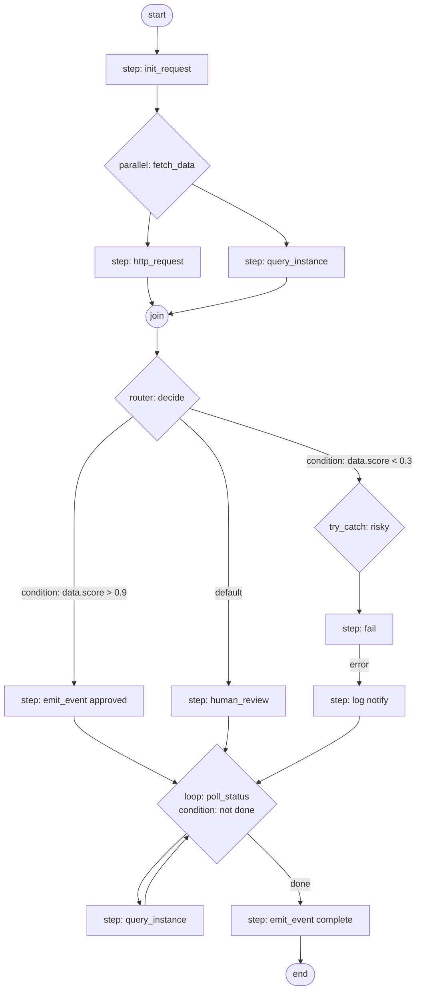

## Task-Flow DAG Model & Sequences

This section is the exhaustive reference for the Orch8 sequence (workflow) model, including the complete block-type taxonomy, edge/ordering semantics, per-block options, lifecycle state machines, and every HTTP endpoint that operates on sequences. It is the authoritative contract for the Vue 3 interactive canvas editor.

Sources:
- `engine/orch8-api/src/sequences.rs`
- `engine/orch8-types/src/sequence.rs`
- `engine/orch8-types/src/execution.rs`
- `engine/orch8-types/src/rollback.rs`

---

### 1. SequenceDefinition Schema

A `SequenceDefinition` is the top-level persisted object. Its `blocks` array is the root of the DAG tree; blocks are executed sequentially in array order unless a composite block type introduces branching or iteration.

#### TypeScript mapping

```ts
interface SequenceDefinition {
  id: string;                        // UUID (SequenceId)
  tenant_id: string;                 // TenantId
  namespace: string;                 // Namespace
  name: string;                      // human-readable workflow name
  version: number;                   // i32 - monotonically incrementing per (tenant, namespace, name)
  deprecated: boolean;               // default false — old versions marked on promote/unpublish
  status: SequenceStatus;            // default "production"
  blocks: BlockDefinition[];         // root-level block list (sequential)
  interceptors?: InterceptorDef;     // optional lifecycle hooks
  input_schema?: unknown;            // JSON Schema — validated on instance create (HTTP 422 on fail)
  sla?: SlaPolicy;                   // optional alert-only SLA policy
  on_failure?: BlockDefinition[];    // best-effort cleanup on terminal Failed
  on_cancel?: BlockDefinition[];     // best-effort cleanup on terminal Cancelled
  created_at: string;                // ISO 8601 DateTime<Utc>
}
```

#### Field table

| Field | Type (TS) | Required | Default | Notes |
|---|---|---|---|---|
| `id` | `string` (UUID) | Yes | — | Server-assigned SequenceId |
| `tenant_id` | `string` | Yes | — | Overwritten by server from auth context |
| `namespace` | `string` | Yes | — | Logical grouping within tenant |
| `name` | `string` | Yes | — | Workflow identifier; must be non-empty |
| `version` | `number` | Yes | — | Integer; auto-incremented on promote |
| `deprecated` | `boolean` | No | `false` | Set on deprecate/unpublish |
| `status` | `SequenceStatus` | No | `"production"` | Lifecycle status |
| `blocks` | `BlockDefinition[]` | Yes | — | Must be non-empty; all block ids globally unique |
| `interceptors` | `InterceptorDef` | No | omitted | Lifecycle interceptors |
| `input_schema` | `unknown` (JSON Schema) | No | omitted | Validated well-formed at create time |
| `sla` | `SlaPolicy` | No | omitted | Alert-only SLA; does NOT fail the instance |
| `on_failure` | `BlockDefinition[]` | No | omitted | Cleanup on terminal `Failed`; errors swallowed |
| `on_cancel` | `BlockDefinition[]` | No | omitted | Cleanup on terminal `Cancelled`; errors swallowed |
| `created_at` | `string` (ISO 8601) | Yes | — | Server-set timestamp |

#### SlaPolicy

```ts
interface SlaPolicy {
  max_runtime?: number;       // milliseconds — max wall-clock lifetime of an instance
  max_step_runtime?: number;  // milliseconds — max time a single step may remain running/waiting
}
```

A breach emits one `instance.sla_breached` webhook and increments `orch8_sla_breached_total`. The instance is NOT failed or paused.

---

### 2. SequenceStatus State Machine

```
Draft ──► Staging ──► Production ──► Unpublished
  │                        │
  └────────────────────────┘
  (both can directly transition to Unpublished)
```

| Status | Valid Transitions | Terminal? |
|---|---|---|
| `draft` | `staging`, `unpublished` | No |
| `staging` | `production`, `unpublished` | No |
| `production` | `unpublished` | No |
| `unpublished` | _(none)_ | **Yes** |

- Default value (when `status` omitted on create): `"production"` (sequence.rs:14)
- `promote_sequence` endpoint requires source to be in `staging`; creates a new version with incremented `version` and `status = production` (sequences.rs:499)
- `unpublish_sequence` also calls `deprecate_sequence` internally on every version; optionally deletes them (sequences.rs:455–465)
- Setting status to `unpublished` via `set_sequence_status` also calls `deprecate_sequence` (sequences.rs:561–566)

---

### 3. Block Type Taxonomy

`BlockDefinition` is a serde-tagged enum: `{ "type": "<variant_snake_case>", ...fields }`. The `type` discriminant is always required. All block ids must be globally unique across the entire sequence (including all nesting depths). Maximum nesting depth: **64** levels (sequence.rs:882).

#### 3.1 Step (leaf)

The fundamental unit of work. Dispatches a named handler with params.

```ts
interface StepBlock {
  type: "step";
  id: string;                           // BlockId — unique across sequence
  handler: string;                      // handler name, must be non-empty
  params: unknown;                      // default {}; arbitrary JSON passed to handler
  delay?: DelaySpec;                    // pre-execution delay
  retry?: RetryPolicy;                  // retry on failure
  timeout?: number;                     // milliseconds; max execution time
  rate_limit_key?: string;              // consume a rate-limit token for this resource key
  send_window?: SendWindow;             // only execute during this time window
  context_access?: ContextAccess;       // restrict context sections visible to handler
  cancellable: boolean;                 // default true; false = step runs to completion on cancel
  wait_for_input?: HumanInputDef;       // pauses for human input via signal "human_input:{block_id}"
  queue_name?: string;                  // named task queue; omit for default queue
  deadline?: number;                    // milliseconds — SLA deadline from step start
  on_deadline_breach?: EscalationDef;   // handler invoked on deadline breach; omit = step fails
  fallback_handler?: string;            // handler used when primary handler's circuit breaker is Open
  cache_key?: string;                   // template-resolved key; skip handler if cache hit
}
```

**Built-in handler names** (unknown names produce warnings, not errors):

| Handler | Purpose |
|---|---|
| `noop` | No-op |
| `log` | Emit log line |
| `sleep` | Sleep for duration |
| `fail` | Unconditionally fail |
| `http_request` | Outbound HTTP call |
| `llm_call` | LLM inference |
| `tool_call` | Tool invocation |
| `mcp_call` | MCP protocol call |
| `agent` | Autonomous agent step |
| `embed` | Generate embeddings |
| `memory_store` | Store to memory |
| `memory_search` | Search memory |
| `human_review` | Human-in-the-loop review |
| `self_modify` | Modify instance context |
| `emit_event` | Emit domain event |
| `send_signal` | Send a signal to another instance |
| `query_instance` | Query another instance's state |
| `set_state` | Write to instance KV state |
| `get_state` | Read from instance KV state |
| `delete_state` | Delete from instance KV state |
| `transform` | Data transform |
| `assert` | Assertion/guard |
| `merge_state` | Merge values into context |
| `blob_put` | Write a blob |
| `blob_get` | Read a blob |

#### 3.2 Parallel (composite)

Executes multiple branches concurrently. All branches must complete before execution continues. Each branch is an ordered list of blocks (sequential within branch).

```ts
interface ParallelBlock {
  type: "parallel";
  id: string;
  branches: BlockDefinition[][];   // ≥1 branch required; each branch is a sequential list
}
```

**DAG edges**: fan-out from `parallel` node to first block of each branch. Join (fan-in) at the block following the `parallel` in the parent list.

**Validation**: `branches` must be non-empty.

#### 3.3 Race (composite)

Like Parallel but completes when the first branch resolves (semantics-dependent). Losing branches are cancelled.

```ts
interface RaceBlock {
  type: "race";
  id: string;
  branches: BlockDefinition[][];   // ≥1 branch required
  semantics: RaceSemantics;        // default "first_to_resolve"
}

type RaceSemantics = "first_to_resolve" | "first_to_succeed";
```

- `first_to_resolve`: completes as soon as any branch finishes (success or failure)
- `first_to_succeed`: waits for the first branch to succeed; if all branches fail, the race fails

**DAG edges**: same fan-out pattern as Parallel; join resolves on first-winning branch.

#### 3.4 Loop (composite)

Iterates body blocks while `condition` is truthy. Condition is a template expression evaluated before each iteration.

```ts
interface LoopBlock {
  type: "loop";
  id: string;
  condition: string;                // template expression, must be non-empty
  body: BlockDefinition[];          // blocks executed each iteration, must be non-empty
  max_iterations: number;           // default 1000; must be > 0
  break_on?: string;                // template expression — break loop if truthy
  continue_on_error: boolean;       // default false; if true, errors in body are swallowed
  poll_interval?: number;           // milliseconds between iterations (u64)
  retain_iterations?: number;       // keep only last N iterations' block outputs; omit = keep all
}
```

**DAG edges**: loop body blocks form a cycle; engine tracks iteration count against `max_iterations`. Canvas should render as a self-looping subgraph.

#### 3.5 ForEach (composite)

Iterates body blocks over each element of a collection expression.

```ts
interface ForEachBlock {
  type: "for_each";
  id: string;
  collection: string;               // template expression resolving to iterable, must be non-empty
  item_var: string;                 // default "item"; variable name for current element, must be non-empty
  body: BlockDefinition[];          // blocks per iteration, must be non-empty
  max_iterations: number;           // default 1000; must be > 0
  retain_iterations?: number;       // keep only last N iterations' outputs
}
```

**DAG edges**: body blocks are sequentially chained within each iteration. Conceptually parallel across items, but engine serializes unless concurrency is explicit.

#### 3.6 Router (composite)

Conditional branching — evaluates ordered route conditions; first match wins. Optionally has a default branch.

```ts
interface RouterBlock {
  type: "router";
  id: string;
  routes: Route[];                  // evaluated in order; first truthy condition wins
  default?: BlockDefinition[];      // executed if no route condition matches
}

interface Route {
  condition: string;                // template expression; must be non-empty
  blocks: BlockDefinition[];        // blocks executed on match
}
```

**Validation**: must have at least one route OR a default block (both optional individually; at least one must be present).

**DAG edges**: fan-out to the winning route's blocks only (mutually exclusive). Canvas renders as a diamond/switch with outgoing conditional edges.

#### 3.7 TryCatch (composite)

Structured error handling. Executes `try_block`; on failure, runs `catch_block`. `finally_block` always runs (success or failure) if present.

```ts
interface TryCatchBlock {
  type: "try_catch";
  id: string;
  try_block: BlockDefinition[];     // must be non-empty
  catch_block: BlockDefinition[];   // may be empty
  finally_block?: BlockDefinition[]; // optional; always runs
}
```

**DAG edges**: `try_block` → (on success) `finally_block` → next; `try_block` → (on error) `catch_block` → `finally_block` → next.

#### 3.8 SubSequence (leaf/composite)

Invokes another named sequence as a child workflow. Parent waits for child to complete.

```ts
interface SubSequenceBlock {
  type: "sub_sequence";
  id: string;
  sequence_name: string;            // must be non-empty; resolved by tenant + namespace + name
  version?: number;                 // optional i32; omit = latest non-deprecated version
  input: unknown;                   // arbitrary JSON passed as child instance's initial context data
}
```

**Canvas note**: this is a leaf at the DAG level (no child blocks in the block tree itself), but at runtime it spawns a complete child workflow. Canvas should render as a "call" node with a link to the referenced sequence.

#### 3.9 ABSplit (composite)

Deterministic A/B traffic splitting. Chosen variant is persisted in block output so retries follow the same path.

```ts
interface ABSplitBlock {
  type: "ab_split";
  id: string;
  variants: ABVariant[];            // ≥2 variants; all variant names must be unique and non-empty
}

interface ABVariant {
  name: string;                     // stable identifier (e.g. "control", "variant_a")
  weight: number;                   // u32 relative weight; total across all variants must be > 0
  blocks: BlockDefinition[];        // blocks executed for this variant
}
```

**Validation**: min 2 variants; total weight > 0; variant names unique and non-empty.

**DAG edges**: fan-out to exactly one variant's blocks at runtime (choice is deterministic/persisted). Canvas renders all variant arms as possible edges.

#### 3.10 CancellationScope (composite)

Wraps child blocks in a non-cancellable boundary (Temporal-style structured concurrency). When an external cancel signal is received, blocks inside this scope run to completion before cancel takes effect.

```ts
interface CancellationScopeBlock {
  type: "cancellation_scope";
  id: string;
  blocks: BlockDefinition[];        // must have ≥1 block
}
```

**DAG edges**: sequential within `blocks`; scope boundary prevents cancel propagation.

---

### 4. DAG Edge / Ordering Semantics

Edges in the sequence DAG derive entirely from the block tree structure:

| Block Type | Edge Pattern | Join Condition |
|---|---|---|
| Root `blocks[]` | Sequential chain | Each block → next |
| `parallel.branches[][]` | Fan-out to all branches simultaneously | All branches complete |
| `race.branches[][]` | Fan-out to all branches simultaneously | First branch resolves/succeeds |
| `loop.body[]` | Sequential chain with back-edge | Until condition false or max_iterations |
| `for_each.body[]` | Sequential chain repeated per item | All items processed |
| `router.routes[].blocks[]` | Exclusive conditional fan-out | One route chosen |
| `try_catch.try_block[]` | Sequential; on error jumps to catch | catch + finally complete |
| `sub_sequence` | Single edge to external child | Child reaches terminal state |
| `ab_split.variants[].blocks[]` | Exclusive deterministic fan-out | Chosen variant complete |
| `cancellation_scope.blocks[]` | Sequential; shields from cancel | All scope blocks complete |

Canvas rendering rule: the DAG is built by traversing the block tree depth-first; the `id` field on every block node is the node identifier in the graph.

---

### 5. Mermaid DAG Example

The following example illustrates a composite workflow with parallel, router, try_catch, and loop blocks:



---

### 6. Per-Block Options Reference

#### 6.1 RetryPolicy

Applied to `StepDef.retry`. Validation: `max_attempts > 0`, `backoff_multiplier > 0`, `initial_backoff <= max_backoff`.

```ts
interface RetryPolicy {
  max_attempts: number;         // u32, must be > 0
  initial_backoff: number;      // milliseconds (Duration serialized as ms)
  max_backoff: number;          // milliseconds
  backoff_multiplier: number;   // default 2.0, must be > 0
}
```

#### 6.2 DelaySpec

Pre-execution delay for a step. Either `duration`-based or `fire_at_local` (wall-clock).

```ts
interface DelaySpec {
  duration: number;                 // milliseconds; used unless fire_at_local is set
  business_days_only: boolean;      // default false; skip weekends/holidays
  jitter?: number;                  // milliseconds; random added to duration
  holidays: string[];               // YYYY-MM-DD dates to skip; merged with context.config.holidays
  fire_at_local?: string;           // ISO 8601 NaiveDateTime e.g. "2026-03-08T02:30:00"; overrides duration
  timezone?: string;                // IANA tz e.g. "America/New_York"; fallback = instance timezone
}
```

#### 6.3 SendWindow

Restricts execution to a time window. Hours are 24h format in instance timezone.

```ts
interface SendWindow {
  start_hour: number;   // 0-23, default 9; validated start_hour != end_hour
  end_hour: number;     // 0-23 exclusive, default 17
  days: number[];       // 0=Mon..6=Sun; empty = all days; each value 0-6
}
```

#### 6.4 ContextAccess

Restricts which context sections the step handler can read.

```ts
interface ContextAccess {
  data: FieldAccess;    // default true (all fields)
  config: boolean;      // default true
  audit: boolean;       // default false
  runtime: boolean;     // default false
}

// FieldAccess variants (untagged — pick one form):
type FieldAccess =
  | boolean                        // true = all, false = none (legacy)
  | "all" | "none"                 // keyword string form
  | { fields: string[] };          // explicit top-level field list
```

#### 6.5 HumanInputDef

When set on a Step, pauses execution and waits for a human signal `human_input:{block_id}`.

```ts
interface HumanInputDef {
  prompt: string;                    // default ""; instructions for reviewer
  timeout?: number;                  // milliseconds; omit = wait indefinitely
  escalation_handler?: string;       // invoked if timeout expires (instead of failing step)
  choices?: HumanChoice[];           // if omitted, defaults to [{label:"Yes",value:"yes"},{label:"No",value:"no"}]
  store_as?: string;                 // context.data key to store decision; default = block_id; must be non-empty if set
  allow_comment: boolean;            // default false; allow reviewer to attach free-text comment
}

interface HumanChoice {
  label: string;    // display text
  value: string;    // stable identifier; must be unique within choices
}
```

**Validation**: if `choices` is set, must be non-empty and all `value` fields unique. `store_as` must be non-empty if set.

#### 6.6 EscalationDef

Invoked on step SLA deadline breach.

```ts
interface EscalationDef {
  handler: string;      // handler name to invoke
  params: unknown;      // default {}
}
```

---

### 7. Execution State: NodeState

Each block in a running instance maps to one or more `ExecutionNode` records tracking per-block execution state.

| State | Meaning |
|---|---|
| `pending` | Not yet started |
| `running` | Actively executing on a worker |
| `waiting` | Dispatched to external worker; awaiting callback |
| `completed` | Successfully finished — terminal |
| `failed` | Errored — terminal |
| `cancelled` | Cancelled by signal — terminal |
| `skipped` | Intentionally bypassed (e.g. losing router branch) — terminal |

Terminal states: `completed`, `failed`, `cancelled`, `skipped`.

#### ExecutionNode schema

```ts
interface ExecutionNode {
  id: string;                        // ExecutionNodeId (UUID)
  instance_id: string;               // InstanceId (UUID)
  block_id: string;                  // BlockId
  parent_id?: string;                // ExecutionNodeId of parent block
  block_type: BlockType;             // one of the BlockType enum values
  branch_index?: number;             // i16; which branch index within parent (parallel/race/router etc.)
  state: NodeState;
  started_at?: string;               // ISO 8601
  completed_at?: string;             // ISO 8601
}

type BlockType =
  | "step" | "parallel" | "race" | "loop" | "for_each"
  | "router" | "try_catch" | "sub_sequence" | "ab_split" | "cancellation_scope";
```

---

### 8. RollbackPolicy (auto-rollback)

Per-tenant, per-sequence error budget policy. When error rate exceeds threshold in the rolling window, the engine can trigger auto-rollback.

```ts
interface RollbackPolicy {
  id: number;                           // i64 — server-assigned
  tenant_id: string;
  sequence_name: string;
  error_rate_threshold: number;         // f64 e.g. 0.05 = 5%
  time_window_secs: number;             // i32 — rolling window for error rate calculation
  enabled: boolean;
  cooldown_secs: number;                // i32 default 3600 — min seconds between rollbacks (anti-flap)
  confirmation_window_secs: number;     // i32 default 60 — error rate must stay above threshold this long
  webhook_url?: string;                 // POST alert payload on rollback trigger
  created_at: string;                   // ISO 8601
  updated_at: string;                   // ISO 8601
}
```

---

### 9. HTTP Endpoints

All endpoints are mounted under both `/api/v1/sequences/...` (primary) and `/sequences/...` (legacy). Auth: `X-API-Key` header required; tenant-scoped keys are pinned to their own tenant. `X-Tenant-Id` optionally contextualizes multi-tenant calls.

#### 9.1 Create Sequence

| | |
|---|---|
| **Method** | `POST` |
| **Path** | `/api/v1/sequences` / `/sequences` |
| **operationId / handler** | `create_sequence` |
| **Auth** | API key (root or tenant) |
| **Request body** | `SequenceDefinition` (JSON) |

**Behavior**:
1. `tenant_id` is overwritten from auth context (`enforce_tenant_create`)
2. `seq.validate()` — structural validation (duplicate block ids, nesting depth, empty handlers, etc.)
3. If `input_schema` is set, validates it is a well-formed JSON Schema
4. Generates `unknown_handler_warnings()` for unrecognized handler names
5. Runs template validation (`orch8_engine::template::validate_sequence_templates`)
6. Runs lint rules (`orch8_engine::lint::lint_sequence`)
7. Persists to storage

**Success response** — `201 Created`:

```json
{ "id": "<uuid>", "warnings": ["..."] }
```

`warnings` is omitted when empty.

**Error responses**:

| Status | Condition |
|---|---|
| `400 Bad Request` | Validation failed (duplicate ids, empty handler, bad retry policy, etc.) |
| `409 Conflict` | Sequence already exists |
| `422 Unprocessable Entity` | Malformed `input_schema` |

---

#### 9.2 Get Sequence by ID

| | |
|---|---|
| **Method** | `GET` |
| **Path** | `/api/v1/sequences/{id}` / `/sequences/{id}` |
| **operationId / handler** | `get_sequence` |
| **Auth** | API key |

**Path parameters**:

| Name | Type | Required | Notes |
|---|---|---|---|
| `id` | `string` (UUID) | Yes | SequenceId |

**Success response** — `200 OK`: full `SequenceDefinition` JSON.

**Error responses**:

| Status | Condition |
|---|---|
| `404 Not Found` | Sequence does not exist |
| `403 Forbidden` | Tenant-scoped key accessing a different tenant's sequence |

---

#### 9.3 Get Sequence by Name

| | |
|---|---|
| **Method** | `GET` |
| **Path** | `/api/v1/sequences/by-name` / `/sequences/by-name` |
| **operationId / handler** | `get_sequence_by_name` |
| **Auth** | API key |

**Query parameters**:

| Name | Type | Required | Default | Notes |
|---|---|---|---|---|
| `tenant_id` | `string` | Yes | — | |
| `namespace` | `string` | Yes | — | |
| `name` | `string` | Yes | — | |
| `version` | `number` (i32) | No | latest | Omit for latest non-deprecated version |

**Success response** — `200 OK`: `SequenceDefinition` JSON.

**Error responses**:

| Status | Condition |
|---|---|
| `404 Not Found` | No matching sequence |
| `403 Forbidden` | Tenant isolation violation |

---

#### 9.4 List Sequences (paginated)

| | |
|---|---|
| **Method** | `GET` |
| **Path** | `/api/v1/sequences` / `/sequences` |
| **operationId / handler** | `list_sequences` |
| **Auth** | API key |

**Query parameters**:

| Name | Type | Required | Default | Constraints |
|---|---|---|---|---|
| `tenant_id` | `string` | No | — | Filters to tenant; tenant-scoped keys are auto-pinned |
| `namespace` | `string` | No | — | Filters by namespace |
| `limit` | `number` (u32) | No | `200` | Capped at `1000` |
| `offset` | `number` (u32) | No | `0` | Pagination offset |

**Success response** — `200 OK`: `PaginatedResponse<SequenceDefinition>` (wrapped, not raw array).

---

#### 9.5 List Sequences Array (non-utoipa, live)

| | |
|---|---|
| **Method** | `GET` |
| **Path** | `/api/v1/sequences.json` / `/sequences.json` |
| **operationId / handler** | `list_sequences_array` |
| **Auth** | API key |
| **Note** | No `@utoipa::path` macro; real live route |

Returns a plain JSON array (no pagination wrapper). Used by mobile SDKs via `loadSequencesFromUrl`. Fetches up to 1000 sequences. Tenant-scoped keys see only their own tenant; root key sees all tenants.

**Query parameters**: none

**Success response** — `200 OK`: `SequenceDefinition[]` (raw array)

---

#### 9.6 List Sequence Versions

| | |
|---|---|
| **Method** | `GET` |
| **Path** | `/api/v1/sequences/versions` / `/sequences/versions` |
| **operationId / handler** | `list_sequence_versions` |
| **Auth** | API key |

**Query parameters**:

| Name | Type | Required | Notes |
|---|---|---|---|
| `tenant_id` | `string` | Yes | |
| `namespace` | `string` | Yes | |
| `name` | `string` | Yes | |
| `version` | `number` | No | Unused by this endpoint (same `ByNameQuery` struct) |

**Success response** — `200 OK`: `SequenceDefinition[]` (all versions for the named sequence)

---

#### 9.7 Delete Sequence

| | |
|---|---|
| **Method** | `DELETE` |
| **Path** | `/api/v1/sequences/{id}` / `/sequences/{id}` |
| **operationId / handler** | `delete_sequence` |
| **Auth** | API key |

**Path parameters**: `id` (UUID)

**Business rule**: rejects delete if any non-terminal instances reference this sequence. Checks `InstanceState` in `{Scheduled, Running, Paused, Waiting}`.

**Success response** — `204 No Content`

**Error responses**:

| Status | Condition |
|---|---|
| `404 Not Found` | Sequence not found |
| `409 Conflict` | Active instances reference this sequence |
| `403 Forbidden` | Tenant isolation |

---

#### 9.8 Deprecate Sequence

| | |
|---|---|
| **Method** | `POST` |
| **Path** | `/api/v1/sequences/{id}/deprecate` / `/sequences/{id}/deprecate` |
| **operationId / handler** | `deprecate_sequence` |
| **Auth** | API key |

Marks the sequence version as `deprecated = true`. Running instances bound to this version continue unaffected; new instances should use a newer version.

**Path parameters**: `id` (UUID)

**Success response** — `204 No Content`

---

#### 9.9 Set Sequence Status

| | |
|---|---|
| **Method** | `POST` |
| **Path** | `/api/v1/sequences/{id}/status` / `/sequences/{id}/status` |
| **operationId / handler** | `set_sequence_status` |
| **Auth** | API key |
| **Note** | No `@utoipa::path` macro; real live route |

**Path parameters**: `id` (UUID)

**Request body**:

```json
{ "status": "staging" }
```

| Field | Type | Required | Enum values |
|---|---|---|---|
| `status` | `SequenceStatus` | Yes | `draft`, `staging`, `production`, `unpublished` |

**Business rule**: transitions are validated against `SequenceStatus::valid_transitions()`. Setting `unpublished` also calls `deprecate_sequence` internally.

**Success response** — `204 No Content`

**Error responses**:

| Status | Condition |
|---|---|
| `400 Bad Request` | Invalid status transition |
| `404 Not Found` | Sequence not found |

---

#### 9.10 Unpublish Sequence (non-utoipa, live)

| | |
|---|---|
| **Method** | `POST` |
| **Path** | `/api/v1/sequences/{name}/unpublish` / `/sequences/{name}/unpublish` |
| **operationId / handler** | `unpublish_sequence` |
| **Auth** | API key |
| **Note** | No `@utoipa::path` macro; real live route |

Marks all versions of the named sequence as `deprecated` and sets status to `unpublished`. Optionally deletes all versions.

**Path parameters**: `name` (sequence name string)

**Request body**:

```json
{ "delete": false }
```

| Field | Type | Required | Default | Notes |
|---|---|---|---|---|
| `delete` | `boolean` | No | `false` | When `true`, hard-deletes all versions after deprecating |

**Note**: hardcoded namespace `"default"` — tenant from auth context or `"default"` if anonymous.

**Success response** — `204 No Content`

---

#### 9.11 Promote Sequence (non-utoipa, live)

| | |
|---|---|
| **Method** | `POST` |
| **Path** | `/api/v1/sequences/{name}/promote` / `/sequences/{name}/promote` |
| **operationId / handler** | `promote_sequence` |
| **Auth** | API key |
| **Note** | No `@utoipa::path` macro; real live route |

Copies the latest version of the named sequence into a new version with `status = production` and `version += 1`. The source must be in `staging` status.

**Path parameters**: `name` (sequence name string)

**Business rule**: source sequence must have `status == staging`; otherwise HTTP 400.

**Success response** — `201 Created`:

```json
{ "id": "<new_uuid>", "version": 3 }
```

**Error responses**:

| Status | Condition |
|---|---|
| `400 Bad Request` | Source not in staging |
| `404 Not Found` | No versions found for name |

---

#### 9.12 Migrate Instance to New Sequence Version

| | |
|---|---|
| **Method** | `POST` |
| **Path** | `/api/v1/sequences/migrate-instance` / `/sequences/migrate-instance` |
| **operationId / handler** | `migrate_instance` |
| **Auth** | API key |

Hot migration: rebinds a running instance to a different sequence version. The instance picks up the new version's block definitions on its next tick.

**Request body**:

```json
{
  "instance_id": "<uuid>",
  "target_sequence_id": "<uuid>"
}
```

| Field | Type | Required | Notes |
|---|---|---|---|
| `instance_id` | `string` (UUID) | Yes | Must be non-terminal |
| `target_sequence_id` | `string` (UUID) | Yes | Must belong to same tenant as instance |

**Business rules**:
- Instance must not be in a terminal state
- Target sequence must belong to the same tenant as the instance (cross-tenant migration is forbidden)

**Success response** — `200 OK`:

```json
{
  "migrated": true,
  "instance_id": "<uuid>",
  "from_sequence_id": "<uuid>",
  "to_sequence_id": "<uuid>"
}
```

**Error responses**:

| Status | Condition |
|---|---|
| `400 Bad Request` | Instance is in terminal state |
| `403 Forbidden` | Target sequence belongs to different tenant |
| `404 Not Found` | Instance or sequence not found |

---

### 10. Endpoint Summary Table

| Method | Path (`/api/v1` prefix) | Legacy Path | Handler | Has utoipa macro |
|---|---|---|---|---|
| `POST` | `/sequences` | `/sequences` | `create_sequence` | Yes |
| `GET` | `/sequences` | `/sequences` | `list_sequences` | Yes |
| `GET` | `/sequences.json` | `/sequences.json` | `list_sequences_array` | **No** |
| `GET` | `/sequences/{id}` | `/sequences/{id}` | `get_sequence` | Yes |
| `DELETE` | `/sequences/{id}` | `/sequences/{id}` | `delete_sequence` | Yes |
| `GET` | `/sequences/by-name` | `/sequences/by-name` | `get_sequence_by_name` | Yes |
| `GET` | `/sequences/versions` | `/sequences/versions` | `list_sequence_versions` | Yes |
| `POST` | `/sequences/{id}/deprecate` | `/sequences/{id}/deprecate` | `deprecate_sequence` | Yes |
| `POST` | `/sequences/{id}/status` | `/sequences/{id}/status` | `set_sequence_status` | **No** |
| `POST` | `/sequences/{name}/unpublish` | `/sequences/{name}/unpublish` | `unpublish_sequence` | **No** |
| `POST` | `/sequences/{name}/promote` | `/sequences/{name}/promote` | `promote_sequence` | **No** |
| `POST` | `/sequences/migrate-instance` | `/sequences/migrate-instance` | `migrate_instance` | Yes |

**4 live routes without `@utoipa::path` macro**: `list_sequences_array`, `set_sequence_status`, `unpublish_sequence`, `promote_sequence`.

---

### 11. Validation Rules Catalogue

| # | Rule | Scope |
|---|---|---|
| 1 | Sequence must have at least one block | `SequenceDefinition.validate()` |
| 2 | All block ids globally unique across the entire block tree | `SequenceDefinition.validate()` |
| 3 | Block id must be non-empty | Per block |
| 4 | `StepDef.handler` must be non-empty | Step |
| 5 | `retry.max_attempts` must be > 0 | Step retry |
| 6 | `retry.backoff_multiplier` must be > 0 | Step retry |
| 7 | `retry.initial_backoff <= retry.max_backoff` | Step retry |
| 8 | `send_window.start_hour` must be 0-23 | Step send_window |
| 9 | `send_window.end_hour` must be 0-23 | Step send_window |
| 10 | `send_window.start_hour != send_window.end_hour` | Step send_window |
| 11 | `send_window.days` values must be 0-6 | Step send_window |
| 12 | `wait_for_input.choices` must be non-empty if provided | HumanInputDef |
| 13 | `wait_for_input.choices[].value` must be unique | HumanInputDef |
| 14 | `wait_for_input.store_as` must be non-empty if provided | HumanInputDef |
| 15 | `parallel.branches` must have ≥1 branch | Parallel |
| 16 | `race.branches` must have ≥1 branch | Race |
| 17 | `loop.condition` must be non-empty | Loop |
| 18 | `loop.body` must be non-empty | Loop |
| 19 | `loop.max_iterations` must be > 0 | Loop |
| 20 | `for_each.collection` must be non-empty | ForEach |
| 21 | `for_each.body` must be non-empty | ForEach |
| 22 | `for_each.item_var` must be non-empty | ForEach |
| 23 | `for_each.max_iterations` must be > 0 | ForEach |
| 24 | `router` must have ≥1 route OR a default block | Router |
| 25 | `router.routes[].condition` must be non-empty | Router route |
| 26 | `try_catch.try_block` must be non-empty | TryCatch |
| 27 | `sub_sequence.sequence_name` must be non-empty | SubSequence |
| 28 | `ab_split.variants` must have ≥2 entries | ABSplit |
| 29 | `ab_split` total weight must be > 0 | ABSplit |
| 30 | `ab_split.variants[].name` must be non-empty and unique | ABSplit |
| 31 | `cancellation_scope.blocks` must have ≥1 block | CancellationScope |
| 32 | Block nesting depth must not exceed 64 | All composites |
| 33 | `input_schema` must be well-formed JSON Schema if provided | SequenceDefinition |
| 34 | Unknown handler names produce warnings (not errors) | SequenceDefinition |
| 35 | Cannot delete sequence with active (Scheduled/Running/Paused/Waiting) instances | Delete endpoint |
| 36 | Status transitions must follow the valid state machine | set_sequence_status |
| 37 | Promote requires source status == staging | promote_sequence |
| 38 | migrate_instance: instance must be non-terminal | migrate_instance |
| 39 | migrate_instance: target sequence must belong to same tenant as instance | migrate_instance |

---

### 12. Entities Summary

| Entity | Key Fields | Notes |
|---|---|---|
| `SequenceDefinition` | `id` (UUID PK), `tenant_id`, `namespace`, `name`, `version` | Versioned; (tenant_id, namespace, name, version) is a natural composite key |
| `BlockDefinition` (enum) | `type`, `id` (BlockId) | Embedded in `SequenceDefinition.blocks` (JSONB) |
| `ExecutionNode` | `id` (UUID PK), `instance_id` (FK), `block_id`, `parent_id` (self-FK), `block_type`, `branch_index`, `state` | Runtime tracking per block |
| `RollbackPolicy` | `id` (i64 PK), `tenant_id`, `sequence_name` | Per-sequence error budget policy |
| `RollbackHistory` | `id` (i64 PK), `tenant_id`, `sequence_name`, `triggered_at` | Audit log of rollback events |

---

### 13. Open Issues

1. `interceptors` field (`InterceptorDef` type) is declared on `SequenceDefinition` but the type definition is in `orch8-types/src/interceptor.rs` — not included in the assigned files. The full shape of `InterceptorDef` (before/after step, on-signal, on-complete, on-failure hooks) is unknown and must be documented from that file.
2. `unpublish_sequence` and `promote_sequence` hardcode `namespace = "default"` (sequences.rs:432, 481). Multi-namespace support for these operations is unclear — the canvas may need to communicate this limitation.
3. `promote_sequence` takes `versions.into_iter().next()` (sequences.rs:491) — this implicitly assumes the storage layer returns versions in newest-first order. If not, it could promote the wrong version. This ordering contract should be verified against the storage implementation.
4. The `PaginatedResponse` wrapper returned by `list_sequences` is not defined in the assigned files. Its exact shape (e.g. `{ data: [], total: number, limit: number, offset: number }`) must be confirmed from `orch8-api/src/lib.rs` or similar.
5. `input_schema` validation at instance-create time mentions HTTP 422, but the `create_sequence` handler only validates well-formedness (not the schema logic). The 422 is emitted by the instance create endpoint — this cross-endpoint coupling should be documented in the instances section.
6. `FieldAccess` is not yet annotated with `ToSchema` (uses `#[schema(value_type = serde_json::Value)]` on `ContextAccess.data`) — OpenAPI consumers will see `unknown` for this field. The Vue form should handle all three wire forms: `boolean`, `string ("all"/"none")`, `{ fields: string[] }`.
7. `BlockDefinition` uses `#[schema(no_recursion)]` — the generated OpenAPI schema will not represent recursive nesting. The Vue canvas must handle arbitrarily nested block trees at runtime even though the OpenAPI spec is flat.
8. The `list_sequences_array` endpoint is described as used by "mobile SDKs" but there is no documented rate limit or auth scope difference vs the paginated endpoint beyond the output shape. Confirm whether this endpoint requires any special permission.
9. Route conflict risk: `/sequences/by-name` and `/sequences/versions` are static string path segments registered on the same router as `/sequences/{id}` which uses a path parameter. Axum resolves static segments over dynamic ones, but the ordering in the `routes()` function should be confirmed as consistent across Axum versions.
10. `on_failure` and `on_cancel` cleanup blocks have their errors swallowed — the canvas should indicate to users that these blocks are "fire and forget" and failures are not surfaced.
